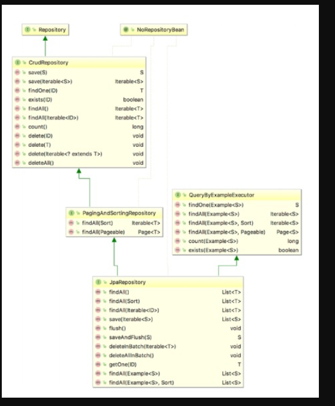

# Spring FAQ

#### Q. What is difference between CrudRepository and JpaRepository interfaces in Spring Data JPA

**Summary**:

PagingAndSortingRepository extends CrudRepository

JpaRepository extends PagingAndSortingRepository

- The CrudRepository interface provides methods for CRUD operations, so it allows you to create, read, update and delete records without having to define your own methods.

- The PagingAndSortingRepository provides additional methods to retrieve entities using pagination and sorting.

- Finally the JpaRepository add some more functionality that is specific to JPA.