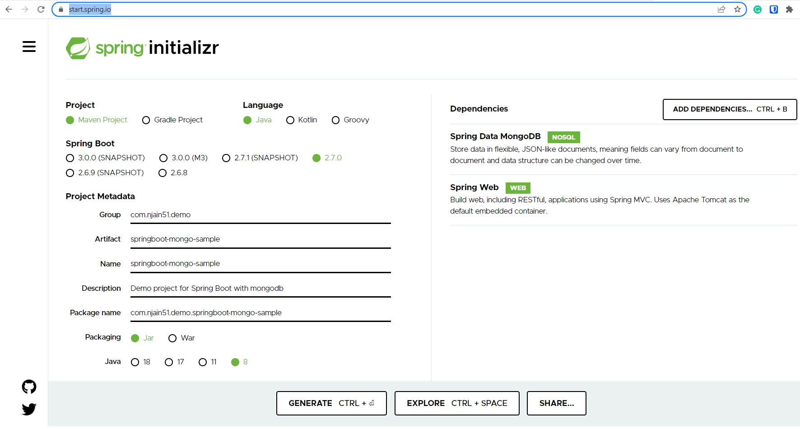
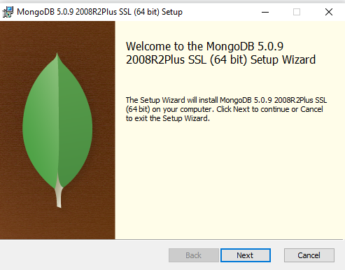
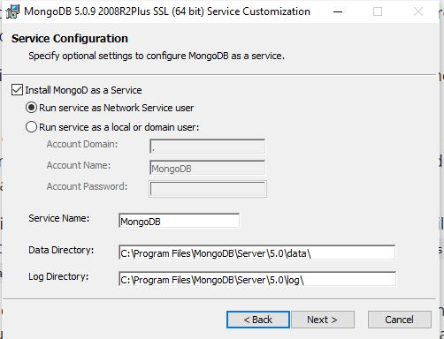
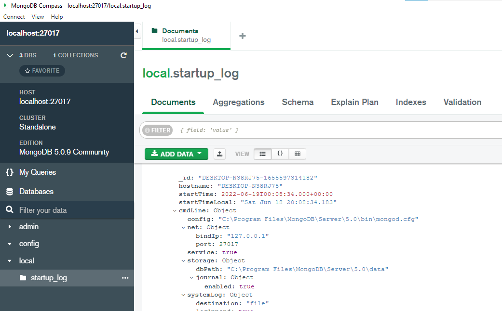

# Sample Springboot application with mongo db

[Reference](https://www.youtube.com/watch?v=TX6KSTbTviw&t=775s)

- create sample app from https://start.spring.io/ 



- import same in intelliJ 

- install mongo server:
  - https://www.mongodb.com/try/download/community?tck=docs_server
  - 
  - 
  - also install mongodb compass - graphical user interface for mongo
  - on installation it will automatically start mongodb service
  - we can have a check via compass as follows: 
  - 

- manually we can run mongo db as follows:
```text
go to C:\Program Files\MongoDB\Server\5.0\bin

 Directory of C:\Program Files\MongoDB\Server\5.0\bin

06/18/2022  08:05 PM    <DIR>          .
06/18/2022  08:05 PM    <DIR>          ..
05/25/2022  02:28 PM             1,558 InstallCompass.ps1
05/25/2022  02:51 PM        22,373,376 mongo.exe
06/18/2022  08:08 PM               605 mongod.cfg
05/25/2022  03:38 PM        47,844,864 mongod.exe
05/25/2022  03:38 PM       534,917,120 mongod.pdb
05/25/2022  03:42 PM        30,443,008 mongos.exe
05/25/2022  03:42 PM       318,246,912 mongos.pdb
               7 File(s)    953,827,443 bytes
               2 Dir(s)  44,385,038,336 bytes free
```
- run **mongod** 
- this will start mongodb server manually. 
- can go to services and check if mongodb running


