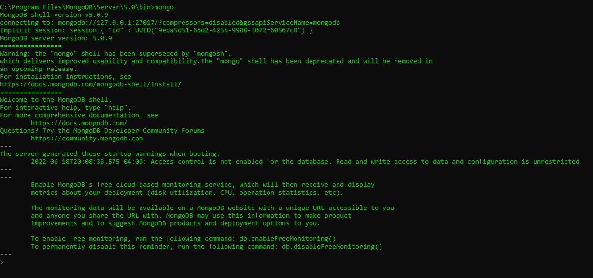

# Working with mongodb

- We can use mongo compass( GUI inteface) to connect with mongo but we will use mongo commandline client for now 
- go to `C:\Program Files\MongoDB\Server\5.0\bin`
- - can run client from here: **mongo** , this will only work when server is running:
- 


## database operations:

- show database:
```text
> show dbs
admin   0.000GB
config  0.000GB
local   0.000GB
```

- create database - this will automatically create database if it's not existing
```text
> use mydb
switched to db mydb
```

- create collections:
```text
> db.createCollection("users")
{ "ok" : 1 }
> show collections
users
```

- In MongoDB, you don't need to create collection. MongoDB creates collection automatically, when you insert some document

- checking data in collections:
```text
> db.users.find()
```

