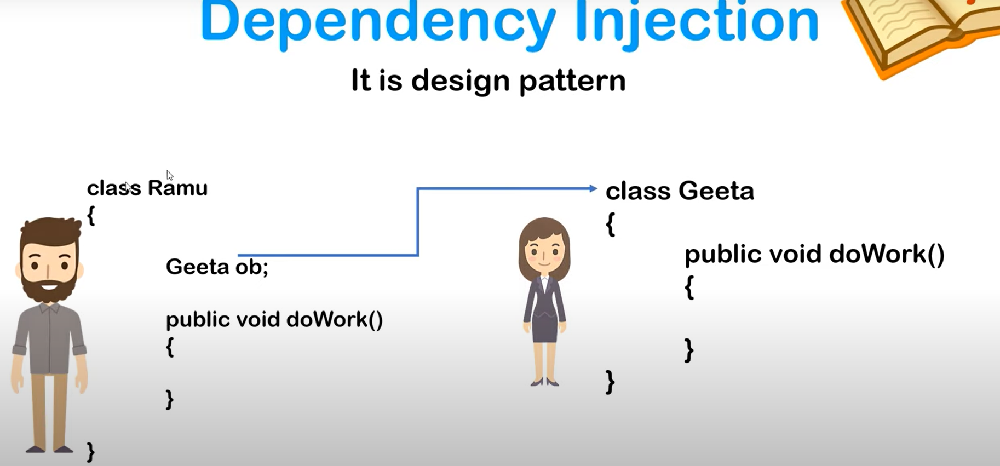
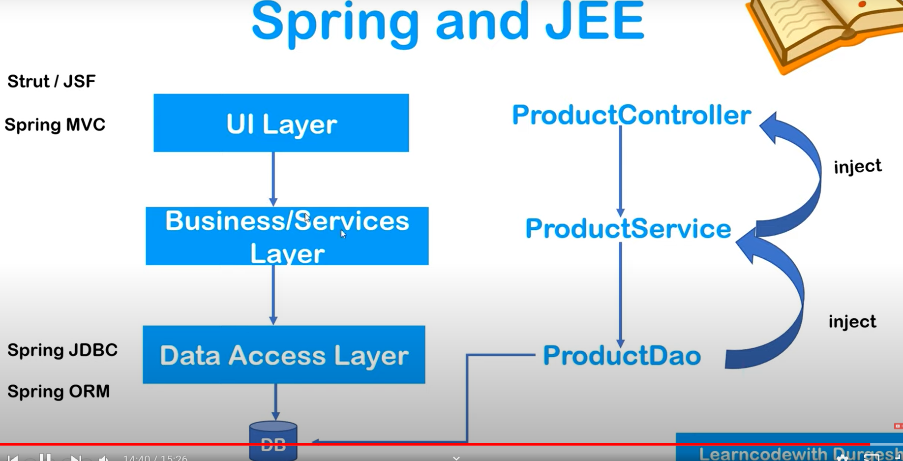
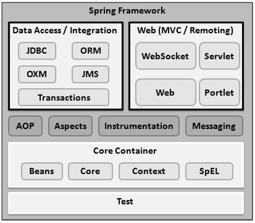

### What is Spring? 

- it's a Dependency injection framework to make Java Applications loosely coupled 
-  To manage large number of java objects for big enterprise apps.
- its makes the easy development of Java EE application. 
- it was developed by Rod Johnson in 2003

#### What is DI and IoC in Spring? 

- Dependency Injection is design pattern
- there are two classes Ramu and Geeta
- For Ramu to doWork it must have object of Geeta class
- So Ramu is dependent on Geeta class
- Usually we will create object of Geeta class using new keywork but in that case both classse would be tightly coupled so if we need to make changes to Geeta class then we need to make cahnges to Ramu class too. 
- spring has capability to create object of another class(Geeta) and inject in another class (Ramu). This is called Dependency injection. 
-  This whole process is called Inversioon of Control(IoC) where we have given control of creating objects to Spring and Spring will automatically create and inject objects of all dependencies at runtime in the given class. 
- this is done via some xml file configuration or annotation. 

- More on DI and IoC here: https://github.com/njain50/giraffe/blob/main/notes_Spring/1.4.0_Dependency_Injection_using_constructor.md

#### How Layers in J2EE work: 

- usually we will have 3 layers in any J2EE application 
- UI Layer - example:  Product Controller which is the layer to actually receive request. 
- Business later or Services layer - example Product Service which will actually do the Job based on request received from Controller. 
- Data Access Layer: example: Product Dao which is will receive data request from Services later and talk to Database to retrieve Data and pass to Services layer. 
- Overall, all these Prodcut Controller, Product Service, Product Dao are java classes only so in order for Product Controller to talk to ProductService it must have object of Product Service and same for ProductDao. 
- This is where Spring comes to rescue, and it helps in creation and injection of objects at runtime. Spring does this with help of xml configuration or annotation help.
- not only this Spring provides various API's/modules/services at each layer which enables many features at each layer. example: Spring JDBC, Spring ORM at Data Access Layer,  Spring MVC or JSF at UI layer, Spring Security or Transaction Management at Business later etc. 

### Spring architecture in detail-

- Spring could potentially be a one-stop shop for all your enterprise applications. 
- However, Spring is modular, allowing you to pick and choose which modules are applicable to you, without having to bring in the rest
- The following section provides details about all the modules available in Spring Framework.

- The Spring Framework provides about 20 modules which can be used based on an application requirement.

##### Core Container 
- The Core Container consists of the Core, Beans, Context, and Expression Language modules the details of which are as follows
- The Core module provides the fundamental parts of the framework, including the **IoC and Dependency Injection features.**
- The **Bean module provides BeanFactory**, which is a sophisticated implementation of the factory pattern.
- The Context module builds on the solid base provided by the Core and Beans modules and it is a medium to access any objects defined and
  configured.
- The ApplicationContext interface is the focal point of the Context module.
- The SpEL module provides a powerful expression language for querying and manipulating an object graph at runtime.

##### Data Access/Integration

- The Data Access/Integration layer consists of the JDBC, ORM, OXM, JMS and Transaction modules whose detail is as follows:

- The JDBC module provides a JDBC-abstraction layer that removes the need for tedious JDBC related coding.
- The ORM module provides integration layers for popular object-relational mapping APIs, including JPA, JDO, Hibernate, and iBatis.
- The OXM module provides an abstraction layer that supports Object/XML mapping implementations for JAXB, Castor, XMLBeans, JiBX and XStream.
-  The Java Messaging Service JMS module contains features for producing and consuming messages.
-  The Transaction module supports programmatic and declarative transaction management for classes that implement special interfaces and for all your
   POJOs. – any object of java class.

##### Web 

- The Web layer consists of the Web, Web-MVC, Web-Socket, and Web-Portlet modules the details of which are as follows

- The Web module provides basic web-oriented integration features such as multipart file-upload functionality and the initialization of the IoC container using servlet listeners and a web-oriented application context.
-  The Web-MVC module contains Spring's Model-View-Controller (MVC) implementation for web applications.
-  The Web-Socket module provides support for WebSocket-based, two-way communication between the client and the server in web applications.
- The Web-Portlet module provides the MVC implementation to be used in a portlet environment and mirrors the functionality of Web-Servlet module.
Miscellaneous

##### There are few other important modules like AOP, Aspects, Instrumentation, Web and Test modules the details of which are as follows:

- The AOP module provides an aspect-oriented programming implementation allowing you to define method-interceptors and pointcuts to cleanly decouple
  code that implements functionality that should be separated.

- The Aspects module provides integration with AspectJ, which is again a powerful and mature AOP framework.

- The Instrumentation module provides class instrumentation support and class loader implementations to be used in certain application servers.

- The Messaging module provides support for STOMP as the WebSocket sub-protocol to use in applications. It also supports an annotation programming
  model for routing and processing STOMP messages from WebSocket clients.

- The Test module supports the testing of Spring components with JUnit or TestNG frameworks.

