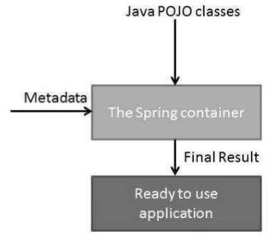

## Spring Container

-  The Spring container is  the most important part of the Spring Framework. The container accesses the class whose objects we want to create, then
   we can wire/connect those objects, configure them, and manage their complete life cycle from creation till destruction.

-  The Spring container uses Dependency Injection (DI) to manage the components that make up an application. These objects are called **Spring
   Beans** 

-  The container gets its instructions on what objects to instantiate, configure, and assemble by reading the configuration metadata provided.

-  The configuration metadata can be represented either by **XML, Java annotations, or Java code**. 

-  The following diagram represents a high-level view of how Spring works. The Spring IoC container makes use of Java POJO classes and configuration
   metadata to produce a fully configured and executable system or application.




### **Spring BeanFactory Container-**

- This is the simplest container providing the basic support for DI and defined by the org.springframework.beans.factory.BeanFactory interface. 

- The BeanFactory and related interfaces, such as BeanFactoryAware, InitializingBean, DisposableBean, are still present in Spring for the purpose of backward compatibility with a large number of third-party frameworks that integrate with Spring. 

- There are a number of implementations of the BeanFactory interface that come straight out-of-the-box with Spring. 

- The most commonly used BeanFactory implementation is the **XmlBeanFactory class.**

- This container reads the configuration metadata from an XML file and uses it to create a fully configured system or application.

- The BeanFactory is usually preferred where the resources are limited like mobile devices or applet-based applications. Thus, use an
  ApplicationContext unless you have a good reason for not doing so.

- Example: 

POJO class:
```java
public class HelloWorld
{ 
   private String message;  
   
   public void setMessage(String message){ 
      this.message  = message; 
   }  
   public void getMessage(){ 
      System.out.println("Your Message : " + message); 
   } 
}
```
```java
import org.springframework.beans.factory.InitializingBean; 
import org.springframework.beans.factory.xml.XmlBeanFactory; 
import org.springframework.core.io.ClassPathResource;  

public class MainApp { 
   public static void main(String[] args) { 
      XmlBeanFactory factory = new XmlBeanFactory (new ClassPathResource("Beans.xml")); 
      HelloWorld obj = (HelloWorld) factory.getBean("helloWorld");    
      obj.getMessage();    
   }
} 
```
xml metadata file: 
```xml
<?xml version = "1.0" encoding = "UTF-8"?>

<beans xmlns = "http://www.springframework.org/schema/beans"
   xmlns:xsi = "http://www.w3.org/2001/XMLSchema-instance"
   xsi:schemaLocation = "http://www.springframework.org/schema/beans
   http://www.springframework.org/schema/beans/spring-beans-3.0.xsd">

   <bean id = "helloWorld" class = "com.tutorialspoint.HelloWorld">
      <property name = "message" value = "Hello World!"/>
   </bean>

</beans>
```


###  **Spring ApplicationContext Container-**

- The Application Context is Spring's advanced container. 

- Similar to BeanFactory, it can load bean definitions, wire beans together, and dispense beans upon request. 

- Additionally, it adds more enterprise-specific functionality such as the ability to resolve textual messages from a properties file and the ability
  to publish application events to interested event listeners.

- This container is defined by org.springframework.context.ApplicationContext interface. 

- **The ApplicationContext includes all functionality of the BeanFactory, It is generally recommended over BeanFactory.**

- BeanFactory can still be used for lightweight applications like mobile devices or applet-based applications. The most commonly used
  ApplicationContext implementations are -

**FileSystemXmlApplicationContext**

- This container loads the definitions of the beans from an XML file. Here you need to provide the full path of the XML bean configuration file to the constructor.


**ClassPathXmlApplicationContext**
  
- This container loads the definitions of the beans from an XML file. Here you do not need to provide the full path of the XML file but you need to set CLASSPATH properly because this container will look like bean configuration XML file in CLASSPATH.


**WebXmlApplicationContext**  

- This container loads the XML file with definitions of all beans from within a web application.


- Example on FileSystemXmlApplicationContext. 

Here is the content of HelloWorld.java file -
  
```java
  public class HelloWorld { private String message;

   public void setMessage(String message){
      this.message  = message;
   }
   public void getMessage(){
      System.out.println("Your Message : " + message);
   }
}

```

```java
import org.springframework.context.ApplicationContext;
import org.springframework.context.support.FileSystemXmlApplicationContext;

public class MainApp {
   public static void main(String[] args) {
      ApplicationContext context = new FileSystemXmlApplicationContext
         ("C:/Users/ZARA/workspace/HelloSpring/src/Beans.xml");
      
      HelloWorld obj = (HelloWorld) context.getBean("helloWorld");
      obj.getMessage();
   }
}
```
Following is the content of the bean configuration file Beans.xml
```xml

<?xml version = "1.0" encoding = "UTF-8"?>

<beans xmlns = "http://www.springframework.org/schema/beans"
   xmlns:xsi = "http://www.w3.org/2001/XMLSchema-instance"
   xsi:schemaLocation = "http://www.springframework.org/schema/beans
   http://www.springframework.org/schema/beans/spring-beans-3.0.xsd">

   <bean id = "helloWorld" class = "com.tutorialspoint.HelloWorld">
      <property name = "message" value = "Hello World!"/>
   </bean>

</beans>
```
