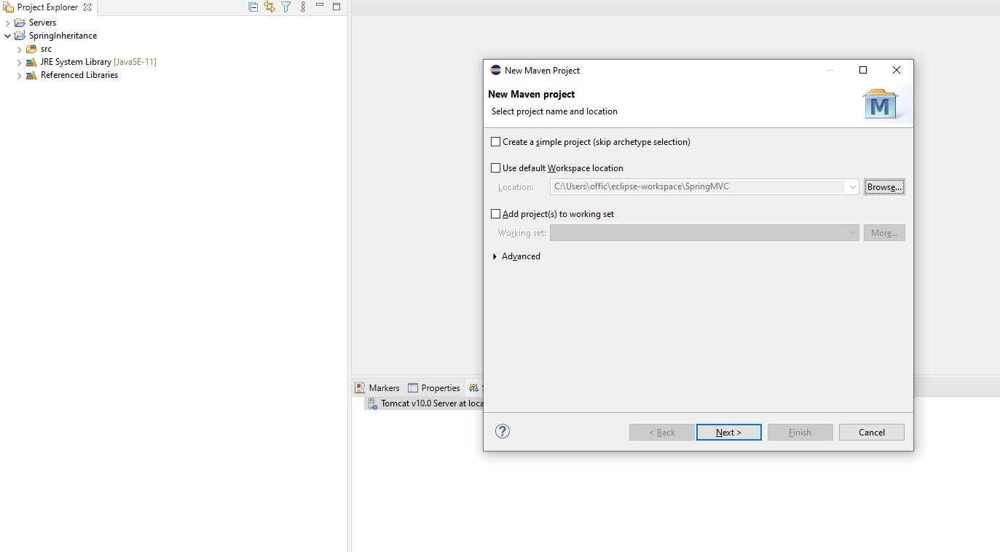
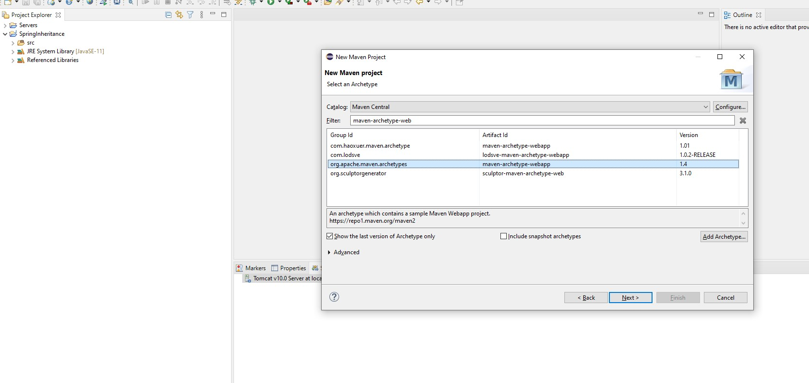
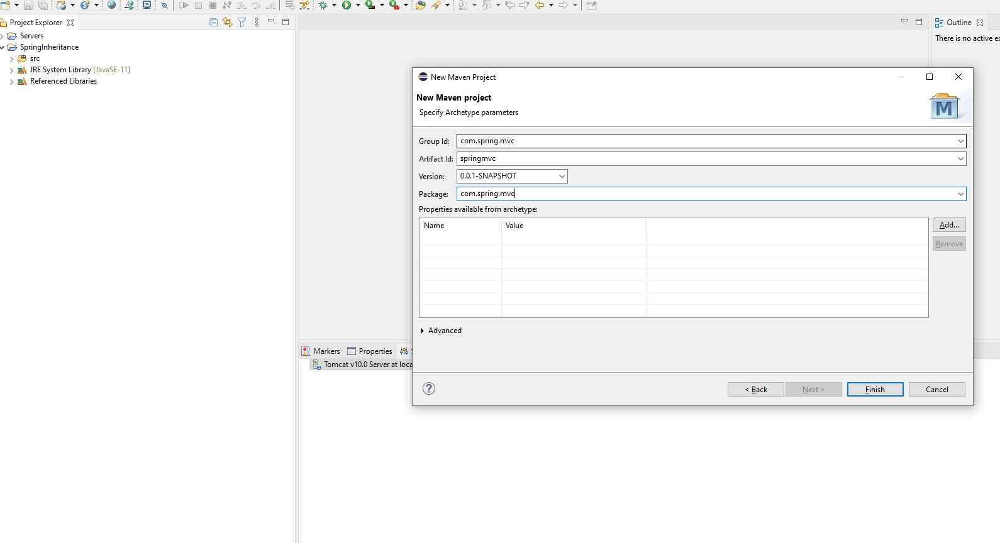
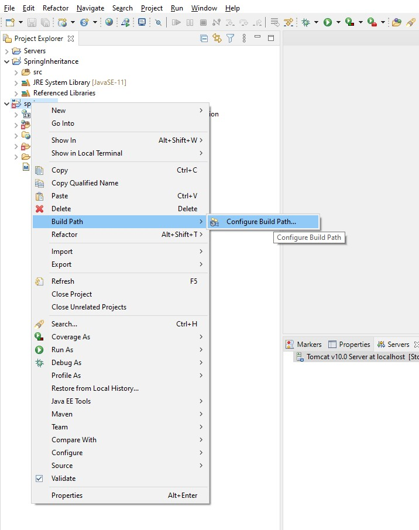
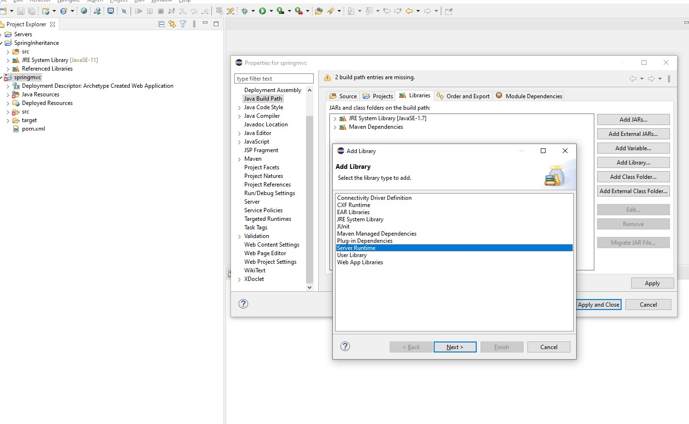
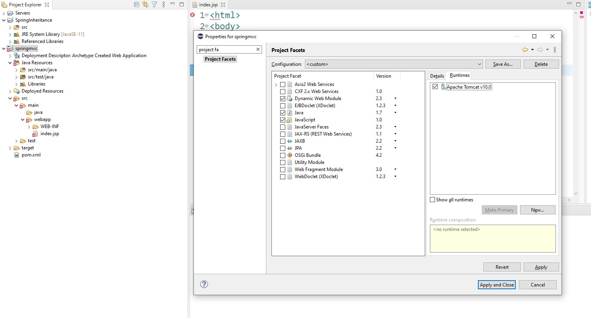
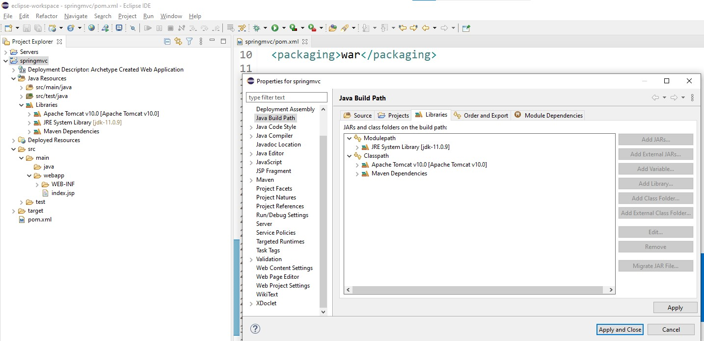
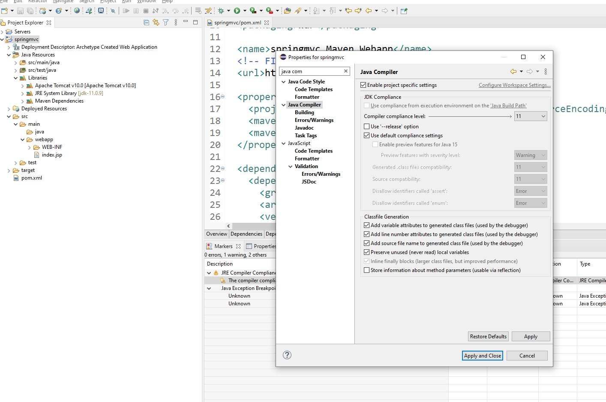
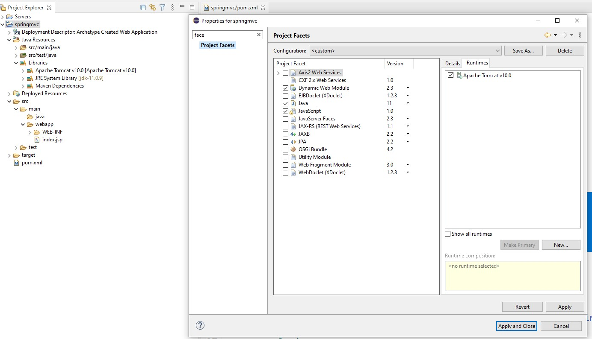

- Steps to setup New Web Project in Spring

-  File => New => Maven Project and follow following steps:










- Once project is created we need to make some changes to get rid of above errors


- (1) Add Tomcat libraries to Build path 











- (2) Ensure Java Compiler compliance level is set to compatible JRE version:



- (3) Added below servlet dependency in pom.xml: 

```text
  <dependency>
    <groupId>javax.servlet</groupId>
    <artifactId>javax.servlet-api</artifactId>
    <version>3.1.0</version>
    <scope>provided</scope>
    </dependency>
```

-  Project Facets settings:
   



- Final Project with no errors: 


