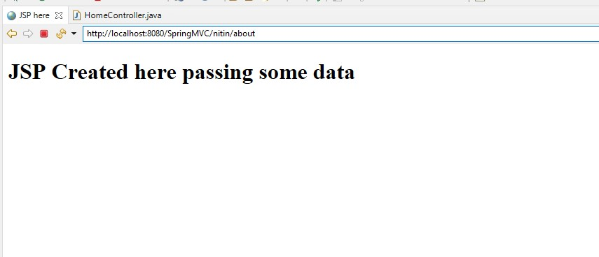

# Play with Springs

- ensure to add "/" after views:
```text
location: /SpringMVC/src/main/webapp/WEB-INF/spring-servlet.xml

 <property name="prefix" value="/WEB-INF/views/"></property>
```

- filename-servlet.xml is taken from here:
```text
/SpringMVC/src/main/webapp/WEB-INF/spring-servlet.xml

lcoation: /SpringMVC/src/main/webapp/WEB-INF/web.xml
<servlet>
        <servlet-name>spring</servlet-name>
        <servlet-class>org.springframework.web.servlet.DispatcherServlet</servlet-class>
   </servlet>
```

- Adding Two more controllers - one in same class and another in differnt class:

```text
http://localhost:8080/SpringMVC/home1
http://localhost:8080/SpringMVC/home
http://localhost:8080/SpringMVC/testview

Both will yeild differnt views
```

-  Adding base url pattern
```text
/SpringMVC/src/main/webapp/WEB-INF/web.xml

<servlet-mapping>
        <servlet-name>spring</servlet-name>
        <url-pattern>/nitin/*</url-pattern>
   </servlet-mapping>
   
Now following will be valid URL:
 http://localhost:8080/SpringMVC/nitin/home
http://localhost:8080/SpringMVC/nitin/home1
   
```

- passing values to view 

Added following to /SpringMVC/src/main/java/springmvc/controller/HomeController.java
```text
	@RequestMapping("/about")
	public String about(Model model) 
	
	{
		System.out.println("This is about URL");
		String str = "passing some data" ;
        model.addAttribute("message", str);
		   
		return "about";
	}
```
And display it in JSP using ${message} expresssion



In case its not working then we need to add following line to JSP: 
```text
<%@ page isELIgnored="false" %>  
The isELIgnored attribute gives you the ability to disable the evaluation of Expression Language (EL) expressions which has been introduced in JSP 2.0.
```

Note:it can also be done by adding following code: 
```html
<body>
<h1> ${message} </h1>

<%
  Object obj = (String)request.getAttribute("message");
%>
<h1>Message is <%=obj%></h1>

</body>
</html>
```

