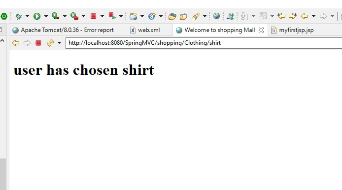

- @RequestMapping Handler can be used at class level or at method level or both to handle incoming requests from user. 


###  Develop a website for a online shopping mall which has 3 departments- Clothing, Stationary and Grocery. Each department will have following items-
```text
Clothing- Shirts, Trousers and Jackets
Stationary- Pens, Pencils and Notebooks
Grocery- Bread, Sugar and Rice
Depending on the user’s input through URL, the message should be displayed on your website showing the chosen item. 
```

Added Controller with folloing sampel code:
```java
package springmvc.controller;
import org.springframework.stereotype.Controller;
import org.springframework.web.bind.annotation.RequestMapping;
import org.springframework.web.bind.annotation.ResponseBody;
import org.springframework.ui.Model;


@Controller
@RequestMapping("/Clothing")
public class FrontController {
 
	@RequestMapping("/shirt")
	public String shirt(Model model)
	{
		   String str = "user has chosen shirt" ;
           model.addAttribute("message", str);
		   
		   return "myfirstjsp";
	}
    
	@RequestMapping("/trousers")
	public String trousers(Model model)
	{
		   String str = "user has chosen trousers" ;
           model.addAttribute("message", str);
		   
		   return "myfirstjsp";
	}
	
	@RequestMapping("/jacket")
	public String jacket(Model model)
	{
		   String str = "user has chosen jacket" ;
           model.addAttribute("message", str);
		   
		   return "myfirstjsp";
	}
}


```

sample jsp:
```html
<%@ page language="java" contentType="text/html; charset=ISO-8859-1"
    pageEncoding="ISO-8859-1"%>
<!DOCTYPE html>
<html>
<head>
<meta charset="ISO-8859-1">
<title>Welcome to shopping Mall</title>
</head>
<body>
<h1> ${message} </h1>
</body>
</html>
```



https://github.com/njain51/springmvc/tree/3.1
