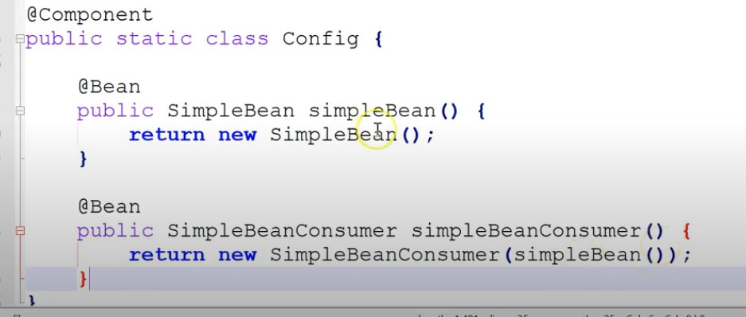
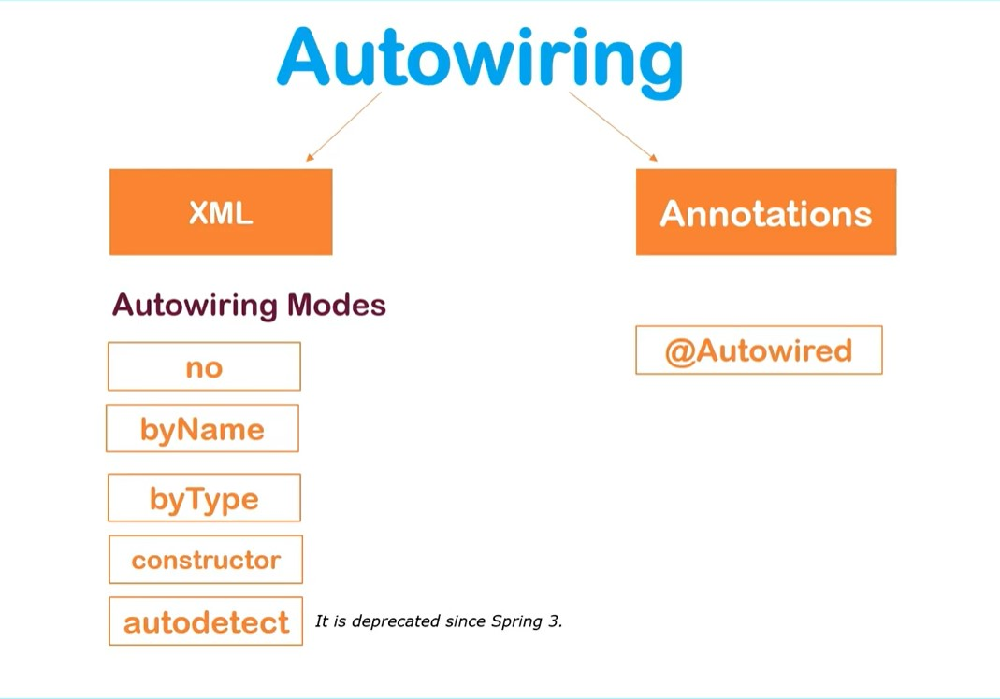
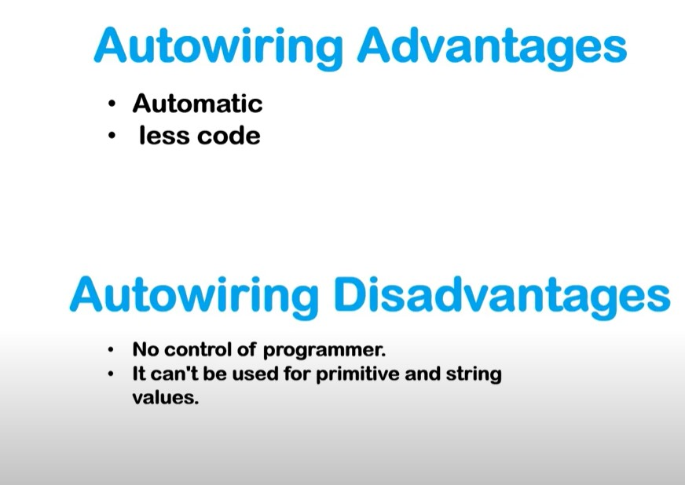

# Annotations in Spring: 

- Different Annotations helps us figure out purpose of that specific class in Spring/ SpringBoot.
- Purpose of using Annotations is just to create object/ bean of that class so that it can be later injected on need basis.

### @Component 
- We use it for general purpose only. 
- In Spring we were using <bean> in xml config file to create bean or object of that class. But without that we can just use @Component to tell Spring/SpringBoot container to create object of that class and make it available when needed. 
- That means if we use @Component with class then Spring Container will register this Class and make object of that class available when needed. 

- You cannot autowire (@Autowired) any class if it is not marked with @Component. It means when you want to autowire any class using annotation that class should be annotated with @Component.

```text
Example:

@Component
public class A { .... }

public class B { 
    @Autowired
    A a;
    .....
    .....
}

```  

- Internally for Student Class when we use @Component, "student" object( note its in lowercase) would be created as follows: 


### @Configuration

-  It is like beans.xml but Java-based bean configuration. It means class annotated with this annotation is the place where beans are configured and will be a candidate for auto-detection. In this class, methods are annotated with @Bean which return an object of the class.

```text
Example:

@Configuration
public class ConfigClass {

    @Bean
    public UserClass getObject() {
        return new UserClass();
    }
}
```
   
- How Spring will know which pacakge to scan and find class is done via @Configuration:
  

- After Spring 3.0, context:component-scan is replaced with @Configuration and @Component-Scan

- Lets see one more example as follows:
  

- Above, SimpleBean is a Singleton class and @Bean is creating object of SimpleBean and SimpleBeanConsumer. Also, Same object is passed to method simpleBeanConsumer as its Singleton only. 
But if we change it to @Compoenent as follows:
  


- In above case now after we replaced @Configuration to @Component then Spring will pass another object of SimpleBean class to simpleBeanConsumer method. So behavior will no more be Singleton. 


### @Autowiring
- feature of Spring Framework in which Spring container inject the dependencies automatically.
- Autowiring cant be used to inject primitive and string values. it works with refeernce only. 







### @Controller 

- we need specific functionality like accessing resource over internet we want to access resource with URL then we need this @Controller.
- it wont work with @Component in such cases.
- we get @RequestMapping for handlers in such cases. Others include: @GetMapping, @PostMapping etc.

### @Repository 
- Persistence Layer or DAO layer.
- all methods related to connectivity with Database is put here.
- will throw exceptions if there are wrong cofiguratino when connecting to database


### @Service   
- its same as @Component but it just tells us that there is some Business Logic used in this class.


### @RestController 

- Combination of what @Controller and @ResponseBody offers. In case we are using @Controller then when doing CRUD operations, we need to
specifically define @ResponseBody to make your method understand of program logic. But with @RestController, we don't need to define @ResponseBody explicitly.


### @ComponentScan -


https://www.youtube.com/watch?v=xYgQfey1p0Y

### @Value

- When declaring pojo classes, we can use @Value notations for declaring default values which would be passed on object creation. 
- we can add toSting() method to this class aand when we print object of this class then it will print these default values too. 
```text
@Component
public class Student {
	@Value("24")
	int age;
	
	@Value("Ramesh Kumar")
	String name;
	
```
