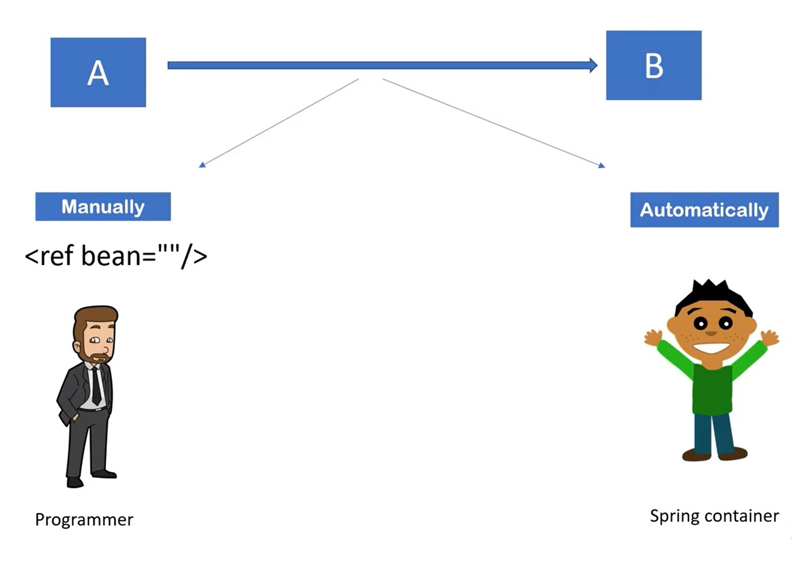

# Annotations in Spring: 

- Different Annotations helps us figure out purpose of that specific class in Spring/SpringBoot.
- Purpose of using Annotations is just to create object/ bean of that class so that it can be later injected on need basis.

## `@Component`
- We use it for general purpose only. 
- In Spring we were using <bean> in xml config file to create bean or object of that class. But without that we can just use `@Component` to tell Spring/SpringBoot container to create object of that class and make it available when needed. 
- That means if we use `@Component` with class then Spring Container will register this Class and make object of that class available when needed. 

- **You cannot autowire (@Autowired) any class if it is not marked with @Component.** 
- It means when you want to autowire any class using annotation that class should be annotated with @Component.

```text
Example:

@Component
public class A { .... }

public class B { 
    @Autowired
    A a;
    .....
    .....
}

```  

- Internally for Student Class when we use @Component, "student" object( note its in lowercase) would be created as follows: 


## `@SpringBootApplciation`

- it consists of following 3 annotations: `@Configuration`, `@EnableAutoConfiguration` and `@Component-Scan`

### `@Configuration`

- its a class level annotation
- Annotating a class with `@Configuration` means that class can be used by Spring IOC Container as a source of bean definition
- It is like beans.xml but Java-based bean configuration. It means class annotated with this annotation is the place where beans are configured and will be a candidate for auto-detection. 
- **In this class, methods are annotated with @Bean which return an object of the class.** Note that method will only return Object. 


```text
Example:

@Configuration
public class ConfigClass {

    @Bean
    public UserClass getObject() {
        return new UserClass();
    }
}
```
   
- How Spring will know which pacakge to scan and find class is done via @Configuration:
  

- After Spring 3.0, context:component-scan is replaced with @Configuration and @Component-Scan

- Let's see one more example as follows:
  

- Above, SimpleBean is a Singleton class and @Bean is creating object of SimpleBean and SimpleBeanConsumer. Also, Same object is passed to method simpleBeanConsumer as its Singleton only. 
But if we change it to @Compoenent as follows:
  


- In above case now after we replaced @Configuration to @Component then Spring will pass another object of SimpleBean class to simpleBeanConsumer method. So behavior will no more be Singleton. 

### `@EnableAutoConfiguration`
- This annotation auto-configures the bean which are present in the classpath 
- This simplifies the developer work by guessing the required beans from the classpath and configure it to  run the  application
- For example, if you have tomcat-embedded.jar in the classpath then you will need a **TomcatEmbeddedServletContainerFactory** bean to configure the tomcat server. This will be searched and configured without any manual configurations.
- All dependencies defined as Maven dependencies etc are in classpath 

### `@Component-Scan`
- it scans a package and all of its sub-packages looking for classes that could be automatically registered as beans in the spring container. 
- So within the sub-packages it will search for classes defined with `@Component` amd regiser its beans in the IoC container. 

## `@Autowiring`
- feature of Spring Framework in which Spring container inject the dependencies automatically.
- Autowiring **cant** be used to inject primitive and string values. it works with refeernce only. 




## `@Controller` 

- we need specific functionality like accessing resource over internet we want to access resource with URL then we need this @Controller.
- it won't work with @Component in such cases.
- we get `@RequestMapping` for handlers in such cases. Others include: `@GetMapping`, `@PostMapping` etc.

## `@Service`   
- It's same as @Component but it just tells us that there is some Business Logic used in this class.


## `@RestController `

- Combination of what @Controller and @ResponseBody offers. In case we are using @Controller then when doing CRUD operations, we need to
specifically define @ResponseBody to make your method understand of program logic. But with @RestController, we don't need to define @ResponseBody explicitly.

## `@Repository`
- **Persistence Layer or DAO layer**.
- **all methods related to connectivity with Database is put here.**
- will throw exceptions if there are wrong configuration when connecting to database


## `@Value`

- When declaring pojo classes, we can use @Value notations for declaring default values which would be passed on object creation. 
- we can add toSting() method to this class aand when we print object of this class then it will print these default values too. 
```text
@Component
public class Student {
	@Value("24")
	int age;
	
	@Value("Ramesh Kumar")
	String name;
	
```


## `Entity`