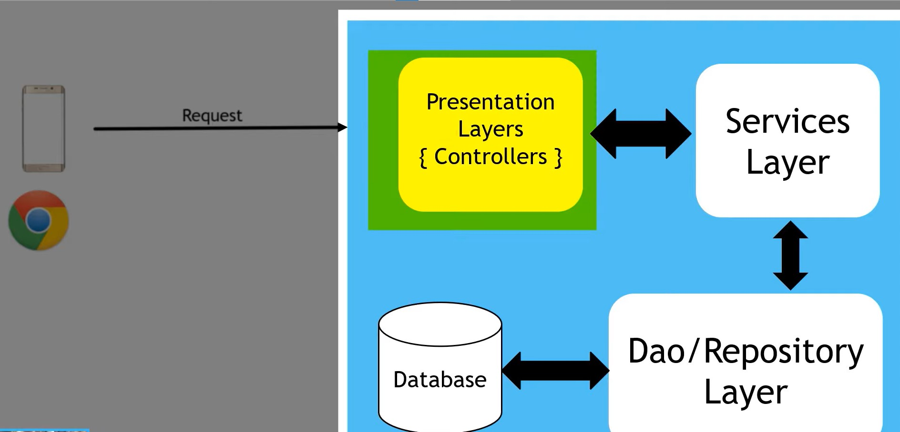

# SpringBoot Rest API

- [Spring Boot Sample Project with rest api calls - working code](https://github.com/njain51/springrest)

# resources

- [ continuation of spring boot notes from here](https://github.com/njain51/cascade)
- [spring-boot-rest-api](https://github.com/njain51/springrest)

- [sample project for springboot rest api - completed](https://github.com/sample-projects-only/hello-nitin-rest-api)

# project objective: 

## topics covered in this project:

- how to create spring boot application using
- spring-boot initializer
- controllers
- services
- what is spring boot project architecture
- spring boot configuration
- how to implement rest api

# Client server request flow: 

### Request/Response Flow
- client will send request to server
- client: mobile, browser etc.
- server : request will be received by controller - which is also called Presentation layer
- they can forward request to Service Layer / Business Layer
- Main work is done by Service Layer
- Service Layer will send or receive data from Repository via DAO layer
- So DAO layer will connect to Repository  and make data available to Service Layer.
- once request is completed by Service Layer, response is sent back to Presentation Layer or Controller
- Controller will send the response back to the client

