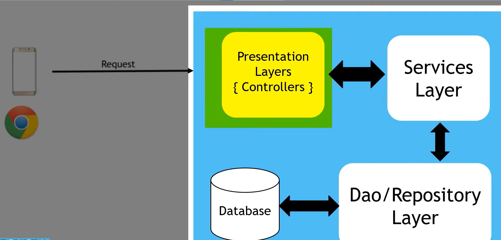

# Client server request flow:

### Request/Response Flow
- client will send request to server
- client: mobile, browser etc.
- server : request will be received by controller - which is also called Presentation layer
- they can forward request to Service Layer / Business Layer
- Main work is done by Service Layer
- Service Layer will send or receive data from Repository via DAO layer
  - so DAO layer or repository layer has all methods/interface to do the task but don't actually implement it. it has to go to implementation layer for actual task implementation or go to database to get the data.
    - database can be mongo, mysql or sometimes for testing we use provide inbuilt data through Collections. 
    - this database schema is usually mapped to entity or model class 
    - example Student class having attributes: id, name etc. to map to database
- So DAO layer will connect to Repository  and make data available to Service Layer.
- once request is completed by Service Layer, response is sent back to Presentation Layer or Controller
- Controller will send the response back to the client

### Model vs entity:- 

**Model**
- In programming we create classes to represent objects
    - these classes known as models have some properties and methods which define objects behavior
    - so a model typically represents a real world object that is related to the problem
    - in model for example Student we will create properties like id, name, city, etc. to map it with the database schema

- **Entity**:
    - An entity represents a single instance of your domain object saved into the database as a record.
    - It has some attributes that we represent as columns in our tables.