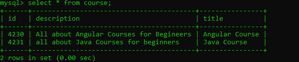

# service methods to be rewritten

- remove list as its no more requried and replace it with JPA object
- rewrite logic for methods 

- run the application and add some data to it:

```text
   {
        "id": 4230,
        "title": "Angular Course",
        "description": "All about Angular Courses for Begineers"
    },
    {
        "id": 4231,
        "title": "Java Course",
        "description": "all about Java Courses for beginners"
    }
```

- can check data added by querying directly to table:
 
