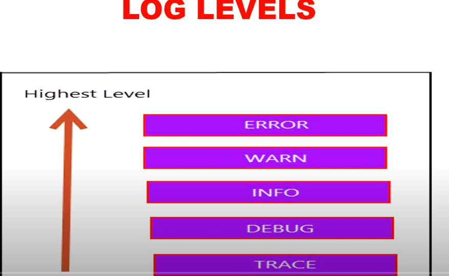
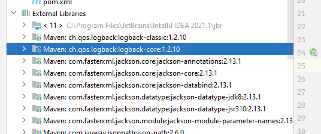
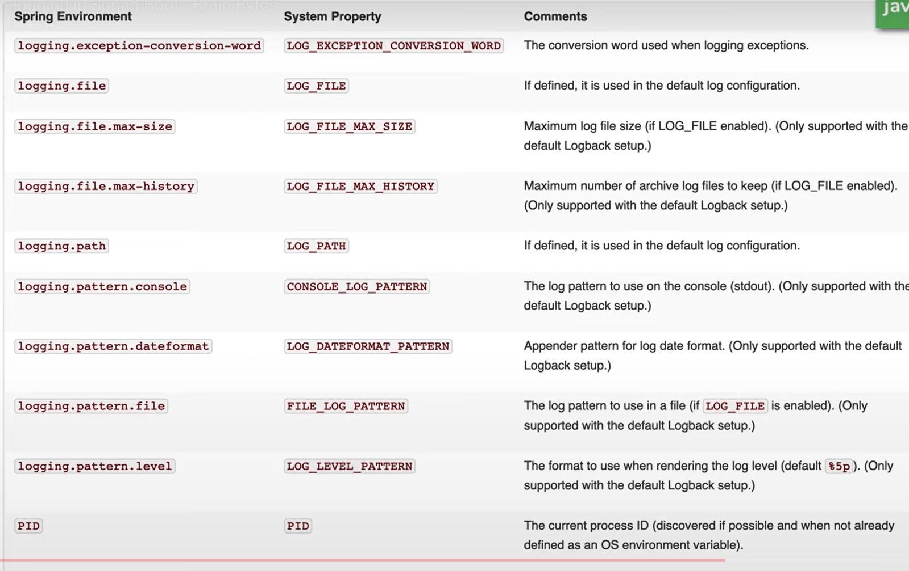
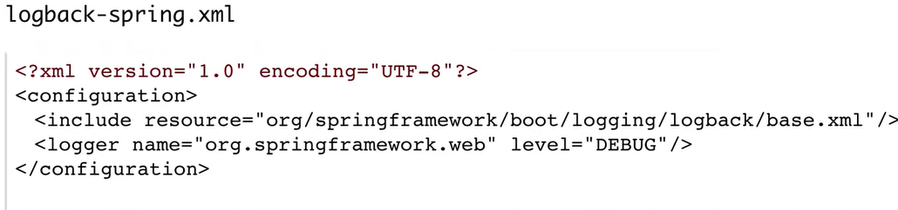
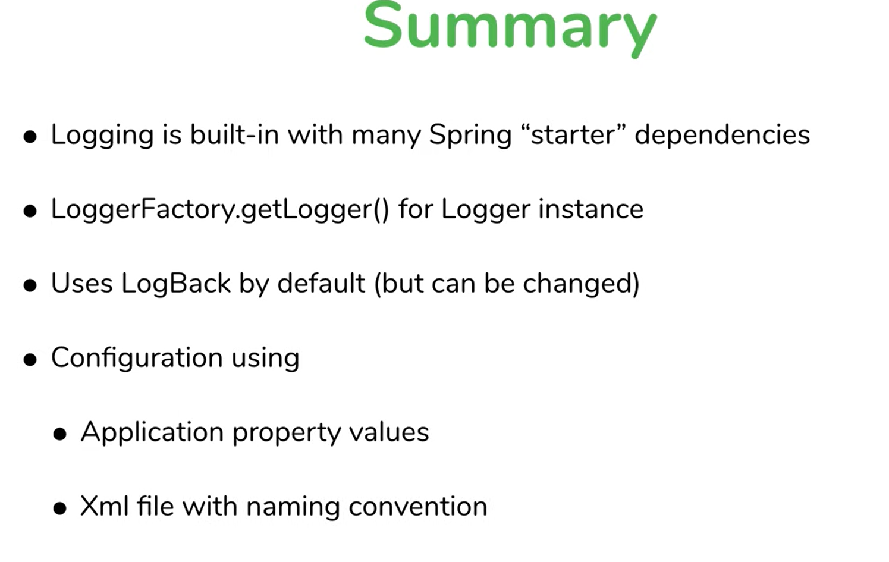

# working of project:
- https://github.com/chandanv89/log-analyser - in java
- https://github.com/PerfectlySoft/Perfect-Logger -> in Swift
- D:\mylearning\SAMPLE_PROJECTS\log-analyser   -> sample project not working 

## coding challenge

- D:\mylearning\log-analyzer -> from scratch

- logging in Springboot: 
  - Proper Logging Network:
    - Configurable
    - we can define Log levels
    - 
    - Log Destination - file, database, splunk etc. 
  
  - about Spring Boot logger:
    - it uses apache commons logging library
    - logback is used by default
    - logging levels -> 
- steps
  - to get logging in Springboot, we can use class called LogginFactory which has static method Logger and takes in class as argument so it knows which class doing loggin

```text
Logger logger = LoggerFactory.getLogger(LogAnalyzerApplication.class);
```

- slf4j package is imported 
- now we can use logger in method:
```text
logger.info("This is my INFO message in method");
```
- when we now run app again and execute "/home" url endpoing, following will be printed in logs

```text
2022-03-09 00:16:40.037  INFO 15840 --- [nio-9092-exec-1] c.n.d.l.LogAnalyzerApplication           : This is my INFO message in method
```

- slf4j is pretty much interface and we need loggin library to log messages 
- when we pull `spring-boot-starter-web` dependency then it will pull `spring-boot-starter-logging` library which adds `Spring-jcl` it stands for Springs-commons-Logging-Bridge
- Logback is framework is successor to log4j framework, its actually doing the implementation for interface slf4j which we are calling 
- more about logback https://logback.qos.ch/
- same we can confirm in external libraries:
- 
- we are calling API via slf4j but slf4j is delegating the work to logging framework which is logback and it comes from starter dependency in Springboot 


## Configuring log levels

- if we change method details as follows:
```text
logger.trace("home Controller accessed");
```
- it will not be printed since trace is not enabled by default.
- default levels enabled are:  error, info, warning
- to be enabled in application.properties - trace, debug

application.properties
```text
logging.level.root=trace
```
- **we can set different log levels at package levels which helps us to debug our application code vs library code** 

```text
# enable trace log level
logging.level.root=info
logging.level.com.nitin.demo.loganalyzer=trace
```
amount of logs much reduced
```text
2022-03-09 00:34:53.140  INFO 19520 --- [nio-9092-exec-1] o.s.web.servlet.DispatcherServlet        : Completed initialization in 1 ms
2022-03-09 00:34:53.157 TRACE 19520 --- [nio-9092-exec-1] c.n.d.l.LogAnalyzerApplication           : home controler accessed
2022-03-09 00:34:54.296 TRACE 19520 --- [nio-9092-exec-2] c.n.d.l.LogAnalyzerApplication           : home controler accessed
2022-03-09 00:34:55.242 TRACE 19520 --- [nio-9092-exec-3] c.n.d.l.LogAnalyzerApplication           : home controler accessed
```

- Other logging properties we can set:



## XML configuration

- Spring boot looks for certain xml file name in class path 
  - logback-spring.xml
  - logback.xml
- above files if present in classpath , we can specify logging configuration in above files and Springboot would automatically look for it 
- example:
- 


## Summary:

