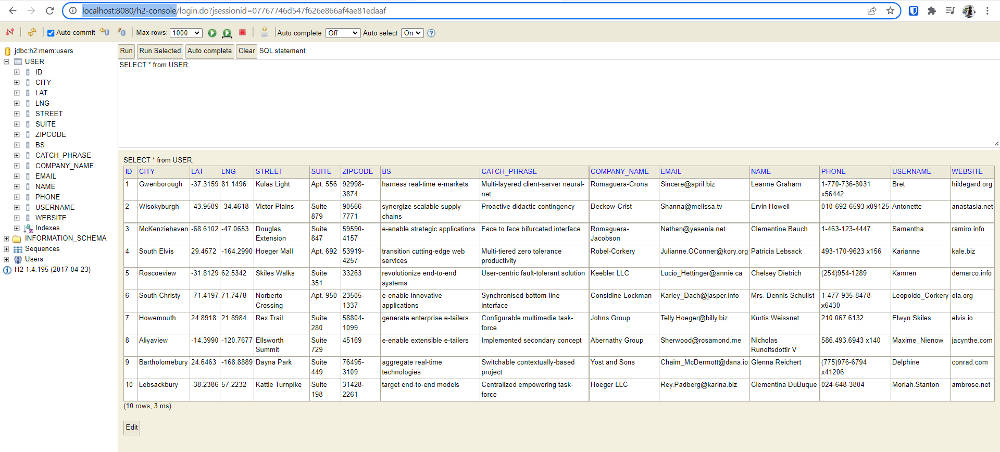
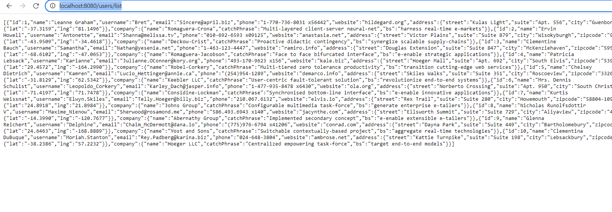

# JSON to POJO and save this POJO into the database.
[Reference](https://www.youtube.com/watch?v=rGdKmF2UzSc)


- Add database connection in application.properties
- Add dependencies
- Generate Sample JSON file from [here](https://jsonplaceholder.typicode.com/)
- we can get users data here :  https://jsonplaceholder.typicode.com/users, copy and save to some users.json file in resources folder.
  sample data
```json
{
    "id": 1,
    "name": "Leanne Graham",
    "username": "Bret",
    "email": "Sincere@april.biz",
    "address": {
      "street": "Kulas Light",
      "suite": "Apt. 556",
      "city": "Gwenborough",
      "zipcode": "92998-3874",
      "geo": {
        "lat": "-37.3159",
        "lng": "81.1496"
      }
    },
    "phone": "1-770-736-8031 x56442",
    "website": "hildegard.org",
    "company": {
      "name": "Romaguera-Crona",
      "catchPhrase": "Multi-layered client-server neural-net",
      "bs": "harness real-time e-markets"
    }
  }
```
- Create Entity Class for this data

- create repository and service class and also provide controller 
- add command line runner to initialize application
```java
@SpringBootApplication
public class JsontodbApplication {

	public static void main(String[] args) {
		SpringApplication.run(JsontodbApplication.class, args);
	}

	@Bean
	CommandLineRunner runner(UserService userService){
	    return args -> {
			// read JSON and load json
			ObjectMapper mapper = new ObjectMapper();
			mapper.configure(JsonParser.Feature.ALLOW_COMMENTS, true);
			TypeReference<List<User>> typeReference = new TypeReference<List<User>>(){};
			InputStream inputStream = TypeReference.class.getResourceAsStream("/json/users.json");
			try {
				List<User> users = mapper.readValue(inputStream,typeReference);
				userService.save(users);
				System.out.println("Users Saved!");
			} catch (IOException e){
				System.out.println("Unable to save users: " + e.getMessage());
			}
	    };
	}
}

```
- on application run, you should get message `Users Saved`
```text
2022-03-13 21:38:41.154  INFO 5676 --- [  restartedMain] o.s.b.a.e.mvc.EndpointHandlerMapping     : Mapped "{[/metrics || /metrics.json],methods=[GET],produces=[application/vnd.spring-boot.actuator.v1+json || application/json]}" onto public java.lang.Object org.springframework.boot.actuate.endpoint.mvc.EndpointMvcAdapter.invoke()
2022-03-13 21:38:41.155  INFO 5676 --- [  restartedMain] o.s.b.a.e.mvc.EndpointHandlerMapping     : Mapped "{[/docs],produces=[text/html]}" onto public java.lang.String org.springframework.boot.actuate.endpoint.mvc.DocsMvcEndpoint.redirect()
2022-03-13 21:38:41.155  INFO 5676 --- [  restartedMain] o.s.b.a.e.mvc.EndpointHandlerMapping     : Mapped "{[/docs/],produces=[text/html]}" onto public java.lang.String org.springframework.boot.actuate.endpoint.mvc.DocsMvcEndpoint.browse()
2022-03-13 21:38:41.156  INFO 5676 --- [  restartedMain] o.s.b.a.e.mvc.EndpointHandlerMapping     : Mapped "{[/health || /health.json],methods=[GET],produces=[application/vnd.spring-boot.actuator.v1+json || application/json]}" onto public java.lang.Object org.springframework.boot.actuate.endpoint.mvc.HealthMvcEndpoint.invoke(javax.servlet.http.HttpServletRequest,java.security.Principal)
2022-03-13 21:38:41.157  INFO 5676 --- [  restartedMain] o.s.b.a.e.mvc.EndpointHandlerMapping     : Mapped "{[/env/{name:.*}],methods=[GET],produces=[application/vnd.spring-boot.actuator.v1+json || application/json]}" onto public java.lang.Object org.springframework.boot.actuate.endpoint.mvc.EnvironmentMvcEndpoint.value(java.lang.String)
2022-03-13 21:38:41.157  INFO 5676 --- [  restartedMain] o.s.b.a.e.mvc.EndpointHandlerMapping     : Mapped "{[/env || /env.json],methods=[GET],produces=[application/vnd.spring-boot.actuator.v1+json || application/json]}" onto public java.lang.Object org.springframework.boot.actuate.endpoint.mvc.EndpointMvcAdapter.invoke()
2022-03-13 21:38:41.157  INFO 5676 --- [  restartedMain] o.s.b.a.e.mvc.EndpointHandlerMapping     : Mapped "{[/dump || /dump.json],methods=[GET],produces=[application/vnd.spring-boot.actuator.v1+json || application/json]}" onto public java.lang.Object org.springframework.boot.actuate.endpoint.mvc.EndpointMvcAdapter.invoke()
2022-03-13 21:38:41.345  INFO 5676 --- [  restartedMain] o.s.b.d.a.OptionalLiveReloadServer       : LiveReload server is running on port 35729
2022-03-13 21:38:41.495  INFO 5676 --- [  restartedMain] o.s.j.e.a.AnnotationMBeanExporter        : Registering beans for JMX exposure on startup
2022-03-13 21:38:41.509  INFO 5676 --- [  restartedMain] o.s.c.support.DefaultLifecycleProcessor  : Starting beans in phase 0
2022-03-13 21:38:41.597  INFO 5676 --- [  restartedMain] s.b.c.e.t.TomcatEmbeddedServletContainer : Tomcat started on port(s): 8080 (http)
Users Saved!
2022-03-13 21:38:41.708  INFO 5676 --- [  restartedMain] com.therealdanvega.JsontodbApplication   : Started JsontodbApplication in 5.363 seconds (JVM running for 7.266)
2022-03-13 21:39:27.204  INFO 5676 --- [nio-8080-exec-1] o.a.c.c.C.[Tomcat].[localhost].[/]       : Initializing Spring FrameworkServlet 'dispatcherServlet'
2022-03-13 21:39:27.204  INFO 5676 --- [nio-8080-exec-1] o.s.web.servlet.DispatcherServlet        : FrameworkServlet 'dispatcherServlet': initialization started
2022-03-13 21:39:27.249  INFO 5676 --- [nio-8080-exec-1] o.s.web.servlet.DispatcherServlet        : FrameworkServlet 'dispatcherServlet': initialization completed in 45 ms
2022-03-13 21:39:27.335  INFO 5676 --- [nio-8080-exec-1] o.h.h.i.QueryTranslatorFactoryInitiator  : HHH000397: Using ASTQueryTranslatorFactory
```
- Check for data here: http://localhost:8080/h2-console , ensure to change db name to `users`



- can also access list here: http://localhost:8080/users/list



[Working code] (https://github.com/njain51/spring-boot-jsontodb)


# csv to db
- https://www.youtube.com/watch?v=po6wM4O1Yxw