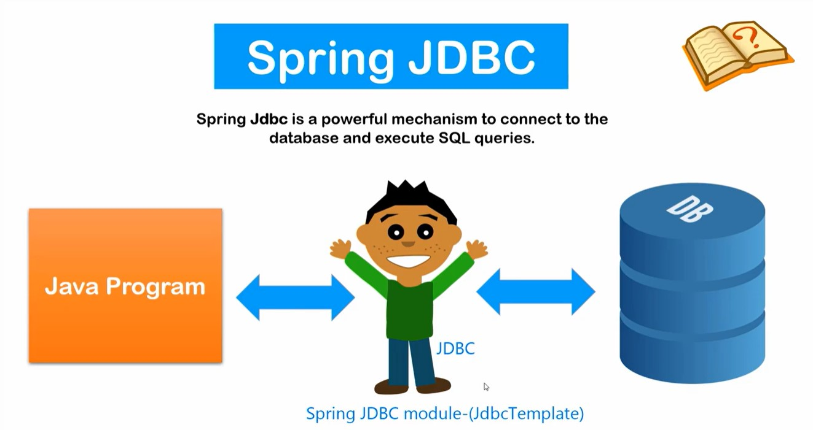
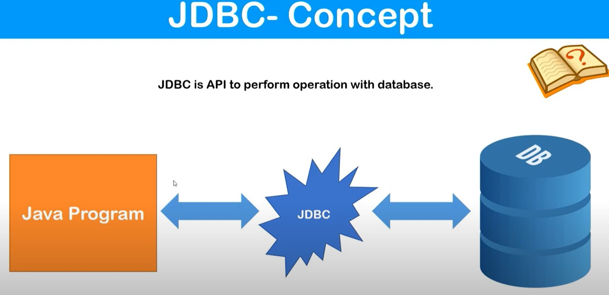
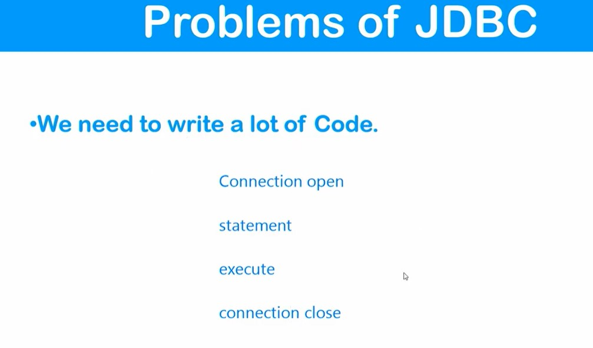
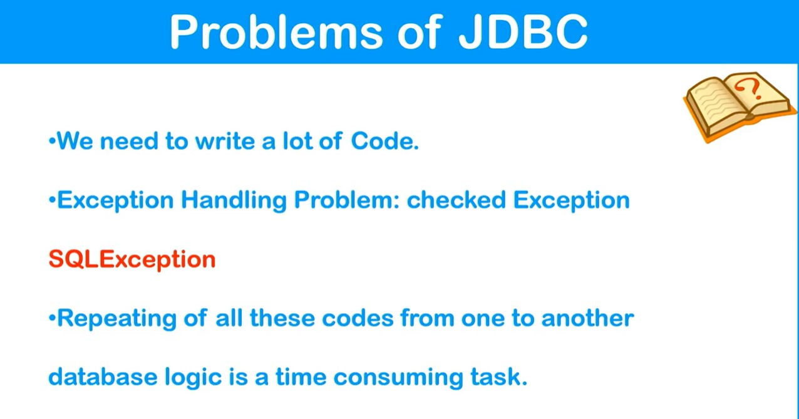
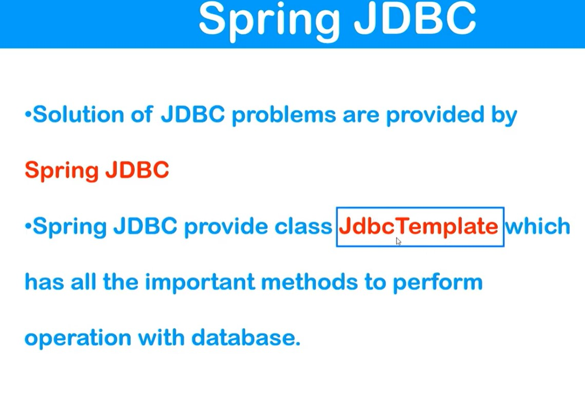
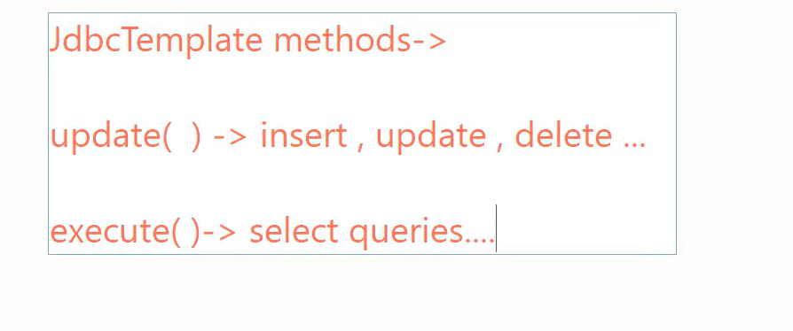

# Spring JDBC

- it's a powerful mechanism to connect to the database and execute SQL queries 
- Solution of JDBC problems are provided by Spring JDBC

- we use SpringJDBC module( Spring JDBC template class) to connect to database

## JDBC Concept

- JDBC is API to perform operation with database
- JDBC connects to Database with help of Database Driver. 

## JDBC Problems

## Spring JDBC - Solution to JDBC

- So we need to create **JDBCTemplate** object first then we will get acces to all important methods of it.
- once we have object of JDBCTemplate we would be able to fire database queries
- **JDBCTemplate** requires datasource object.
- datasource object is created from DataSource interface
- **DriverManagerDataSource** is implementation class for DataSource interface
- Since we can pass child Class object where we need to pass parent class object, So basically we will inject object of DriverManagerDataSource class to datasource properties of JDBC template
- information needed to be passed when creating object of DriverManagerDataSource are : driverClassName; url ( protocol:sub-protocol:location); username ; password
- with above info provided to DriverManagerDataSource, then object of DriverManagerDataSource can be injected to datasource properties.
- we can then prepare its object in JDBC template and then fire queries as requried. 

## JDBCTemplate methods: 

