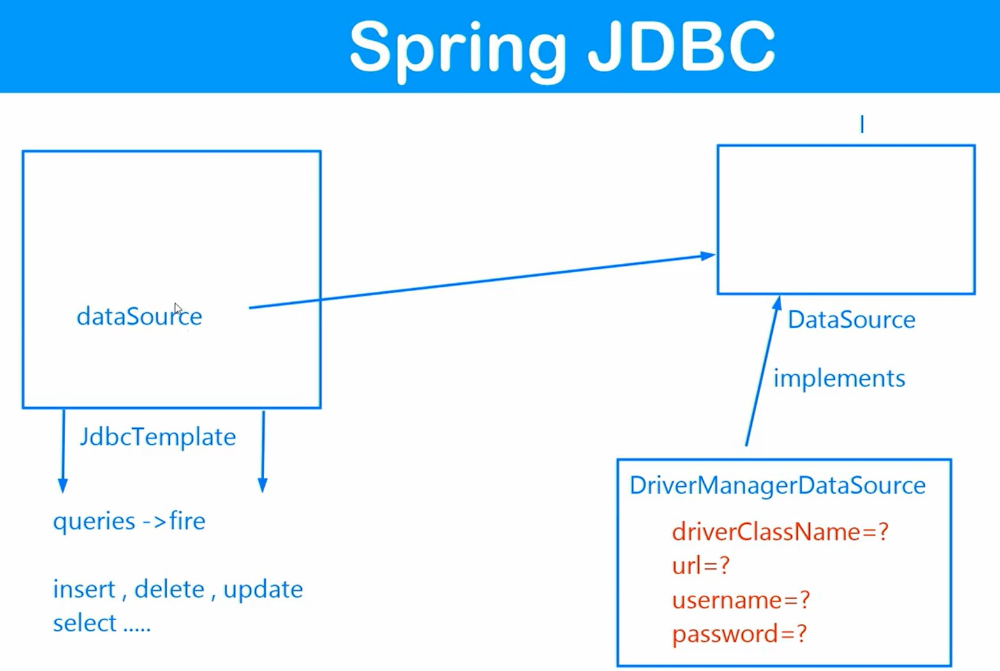

#Spring JDBC

- its a powerful mechanism to connect to the database and execute SQL queries 
- Solution of JDBC problems are provided by Spring JDBC

- we use SpringJDBC module( Spring JDBC template class) to connect to database

## JDBC Concept

- JDBC is API to perform operation with database

## JDBC Problems

## Spring JDBC - Solution to JDBC

- we can fire SQL queries with help of JDBC template
- to fire queries it need datasource object 
- datasource object is created from DataSource interface
- DriverManagerDataSource is implementation class for DataSource interface
- Since we can pass child Class object where we need to pass parent class object, So basically we will inject object of DriverManagerDataSource class to datasource properties of JDBC template
- information needed to be passed when creating object of DriverManagerDataSource are : driverClassName; url ( protocol:sub-protocol:location); username ; password
- with above info provided to DriverManagerDataSource, then object of DriverManagerDataSource can be injected to datasource properties.
- we can then prepare its object in JDBC template and then fire queries as requried. 

## JDBCTemplate methods: 

