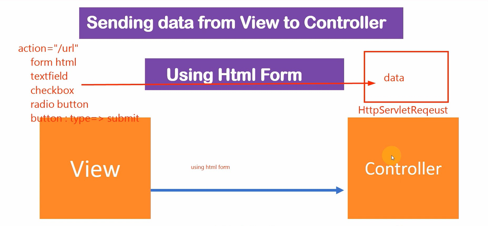

# Sending Data from View to Controller



- User can submit data from view , we can create form in view to receive input data from user. 
- Data sent by View to controller is received by HttpServletRequst and it create data objects and send to Controller. 
- Which controller will receive data from view is decided by "action" URL in view
- Controller will get data from View using HttpServletRequst in ServletContainer using getParameter("name of field"). 
- In Spring MVC we use @RequestParam for getting single parameter. 
- If we need to receive all data from view in one go then we use model attribute( @ModelAttribute) , for this we need to create entity class( which are basically pojo classes)   
- So basically Servletcontainer helps getting data from view , creating  data objects and also passing it to Controller. 
- 


Create view: 
- Get Bootstrap code from here: https://getbootstrap.com/docs/5.0/getting-started/introduction/ and past to new view:
  /SpringMVC/src/main/webapp/WEB-INF/views/getdetails.jsp   
  
```text
<!doctype html>
<html lang="en">
  <head>
    <!-- Required meta tags -->
    <meta charset="utf-8">
    <meta name="viewport" content="width=device-width, initial-scale=1">

    <!-- Bootstrap CSS -->
    <link href="https://cdn.jsdelivr.net/npm/bootstrap@5.0.0-beta2/dist/css/bootstrap.min.css" rel="stylesheet" integrity="sha384-BmbxuPwQa2lc/FVzBcNJ7UAyJxM6wuqIj61tLrc4wSX0szH/Ev+nYRRuWlolflfl" crossorigin="anonymous">

    <title>Hello, world!</title>
  </head>
  <body>
    <h1>Hello, world!</h1>

    <!-- Optional JavaScript; choose one of the two! -->

    <!-- Option 1: Bootstrap Bundle with Popper -->
    <script src="https://cdn.jsdelivr.net/npm/bootstrap@5.0.0-beta2/dist/js/bootstrap.bundle.min.js" integrity="sha384-b5kHyXgcpbZJO/tY9Ul7kGkf1S0CWuKcCD38l8YkeH8z8QjE0GmW1gYU5S9FOnJ0" crossorigin="anonymous"></script>

    <!-- Option 2: Separate Popper and Bootstrap JS -->
    <!--
    <script src="https://cdn.jsdelivr.net/npm/@popperjs/core@2.6.0/dist/umd/popper.min.js" integrity="sha384-KsvD1yqQ1/1+IA7gi3P0tyJcT3vR+NdBTt13hSJ2lnve8agRGXTTyNaBYmCR/Nwi" crossorigin="anonymous"></script>
    <script src="https://cdn.jsdelivr.net/npm/bootstrap@5.0.0-beta2/dist/js/bootstrap.min.js" integrity="sha384-nsg8ua9HAw1y0W1btsyWgBklPnCUAFLuTMS2G72MMONqmOymq585AcH49TLBQObG" crossorigin="anonymous"></script>
    -->
  </body>
</html>
```

- Adding field: 
- Get form data code from here: https://getbootstrap.com/docs/5.0/forms/form-control/
```text
<div class="mb-3">
  <label for="exampleFormControlInput1" class="form-label">Email address</label>
  <input type="email" class="form-control" id="exampleFormControlInput1" placeholder="name@example.com">
</div>
```

- Sizing: 
- Set heights using classes like .form-control-lg and .form-control-sm. 
```text
<input class="form-control form-control-lg" type="text" placeholder=".form-control-lg" aria-label=".form-control-lg example">
<input class="form-control" type="text" placeholder="Default input" aria-label="default input example">
<input class="form-control form-control-sm" type="text" placeholder=".form-control-sm" aria-label=".form-control-sm example">
```
- once form is done, we will add <form  action="processForm method = "POST"> to basically submit data to controller. 

- Compelte requestdetails.jsp would be: /SpringMVC/src/main/webapp/WEB-INF/views/getdetails.jsp

```html
<%@ page language="java" contentType="text/html; charset=ISO-8859-1"
pageEncoding="ISO-8859-1"%>


<!doctype html>
<html lang="en">
<head>
  <!-- Required meta tags -->
  <meta charset="utf-8">
  <meta name="viewport" content="width=device-width, initial-scale=1, shrink-to-fit=no">

  <!-- Bootstrap CSS -->
  <link rel="stylesheet" href="https://stackpath.bootstrapcdn.com/bootstrap/4.3.1/css/bootstrap.min.css" integrity="sha384-ggOyR0iXCbMQv3Xipma34MD+dH/1fQ784/j6cY/iJTQUOhcWr7x9JvoRxT2MZw1T" crossorigin="anonymous">

  <title>User Details</title>
</head>
<body>

<div class="container">
  <h1>Employee Register Form:</h1>
  <div class="card">
    <div class="card-body">
      <form action="processForm" method="post">

        <div class="form-group row">
          <label for="userName" class="col-sm-2 col-form-label">
            Name</label>
          <div class="col-sm-7">
            <input type="text" class="form-control" name="userName"
                   placeholder="Enter first name">
          </div>
        </div>

        <div class="form-group row">
          <label for="userAge" class="col-sm-2 col-form-label">
            Name</label>
          <div class="col-sm-7">
            <input type="number" class="form-control" name="userAge"
                   placeholder="Enter Age">
          </div>
        </div>

        <div class="form-group row">
          <label for="userEmail" class="col-sm-2 col-form-label">
            Name</label>
          <div class="col-sm-7">
            <input type="email" class="form-control" name="userEmail"
                   placeholder="Enter email">
          </div>
        </div>

        <button type="submit" class="btn btn-primary">Submit</button>
      </form>
    </div>
  </div>
</div>

<!-- Optional JavaScript -->
<!-- jQuery first, then Popper.js, then Bootstrap JS -->
<script src="https://code.jquery.com/jquery-3.3.1.slim.min.js" integrity="sha384-q8i/X+965DzO0rT7abK41JStQIAqVgRVzpbzo5smXKp4YfRvH+8abtTE1Pi6jizo" crossorigin="anonymous"></script>
<script src="https://cdnjs.cloudflare.com/ajax/libs/popper.js/1.14.7/umd/popper.min.js" integrity="sha384-UO2eT0CpHqdSJQ6hJty5KVphtPhzWj9WO1clHTMGa3JDZwrnQq4sF86dIHNDz0W1" crossorigin="anonymous"></script>
<script src="https://stackpath.bootstrapcdn.com/bootstrap/4.3.1/js/bootstrap.min.js" integrity="sha384-JjSmVgyd0p3pXB1rRibZUAYoIIy6OrQ6VrjIEaFf/nJGzIxFDsf4x0xIM+B07jRM" crossorigin="anonymous"></script>
</body>
</html>
```