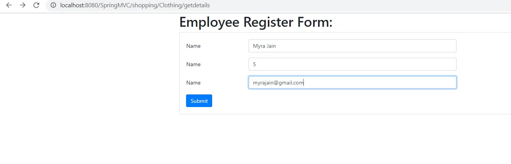
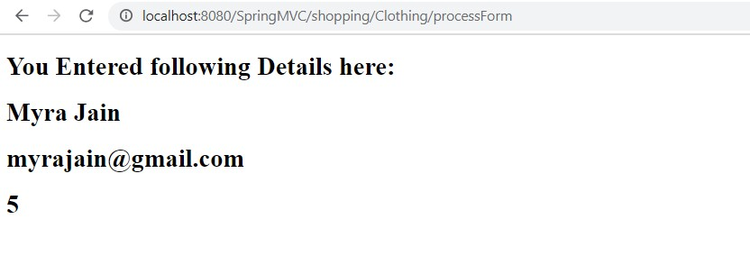

- Now that we have created form already as per /SpringMVC/src/main/webapp/WEB-INF/views/getdetails.jsp, in this we will write our controller to handle data received from form: 

-  Added following code to Controller to receive data and sumbit data to another view

/SpringMVC/src/main/java/springmvc/controller/FrontController.java
```text
 @RequestMapping(path ="/processForm", method= RequestMethod.POST)
	 public String processForm(@RequestParam String userName, @RequestParam int userAge ,@RequestParam String userEmail, Model model)  {
		 System.out.println("user Name is " + userName);
		 System.out.println("user Age is " + userAge);
		 System.out.println("user Email is " + userEmail);
		 
		 model.addAttribute("email",userEmail);
		 model.addAttribute("name",userName);		 
		 model.addAttribute("age",userAge);
		 
		 
		 return "myfirstjsp";
	 }
```
Display details in another view: 
/SpringMVC/src/main/webapp/WEB-INF/views/myfirstjsp.jsp

```html
<%@ page language="java" contentType="text/html; charset=ISO-8859-1"
	pageEncoding="ISO-8859-1"%>
<%@ page isELIgnored="false"%>
<%@ page import="java.util.ArrayList"%>
<%@ page import="java.util.List"%>
<%@ taglib prefix = "c" uri = "http://java.sun.com/jsp/jstl/core" %>
<!DOCTYPE html>
<html>
<head>
<meta charset="ISO-8859-1">
<title>Welcome to shopping Mall</title>
</head>
<body>
	 

 <!-- Displaying User details -->
    <h1>You Entered following Details here: </h1>
      <h1>${name}</h1>
      <h1>${email}</h1>
      <h1>${age}</h1>
 
  

</body>
</html>
```

output:




\

Complete Code here: https://github.com/njain51/springmvc/tree/5.0