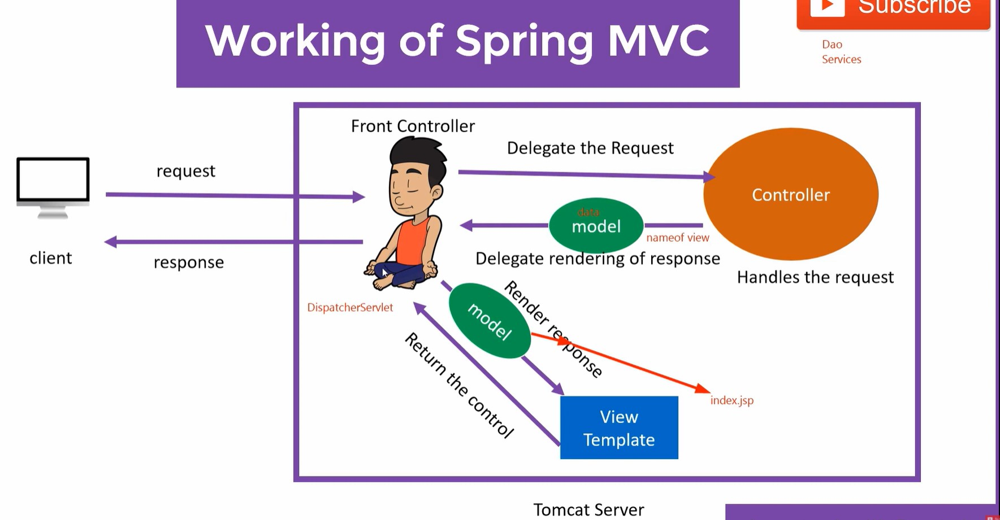

#### MVC

M: Model => Data
V: view => Presents Data to User
C: Controller =>  Interface between Model and view

- MVC design pattern is way to design our code in our Application 

- Servlet which acts as Controller accept request from User, it then take data input from database and with business logic implemented it will fulfill users request and send response to the view. 

- it works on Client Server Architecture Design pattern

- client sends request to server ( Tomcat Server) . 
- Request will reach to Front Controller. It will take help from Handler Mapping so it will delegate request to Backend Controller. 
- Backend Controller will handles the request 
- It can take help from other components. Like Service Layer, Data layer etc. to complete the request.
- After Completing the request Backend Controller will send back the request(with data included) to the Front Controller. Also, it will pass the name of view which need to be presented to the client.

- Front Controller will take help from View Resolver and based on data gathered previously from Backend Controller it will inject data to required view. View Resolver helps in resolving view based on view name passed by Backend Controller to Front Controller. 
  
- Next it will receive response back with required view and data to be presented to user. 

- Front Controller will send response back to the client. 

