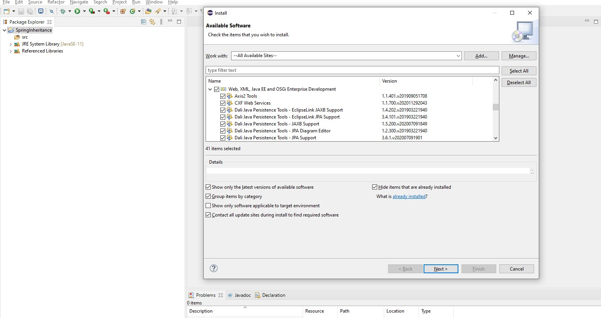
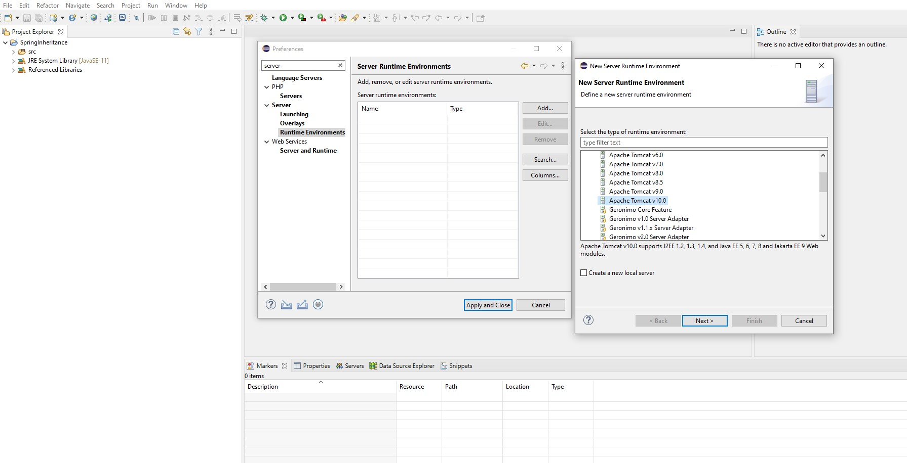
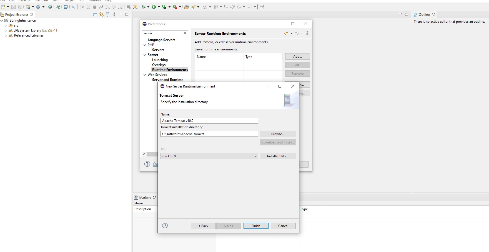
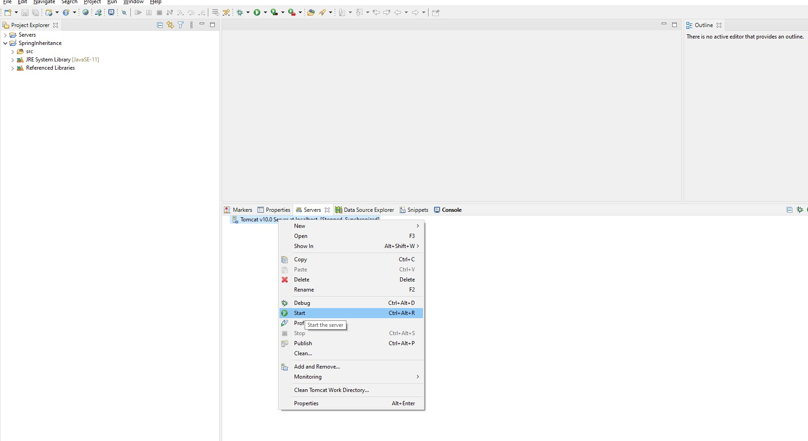
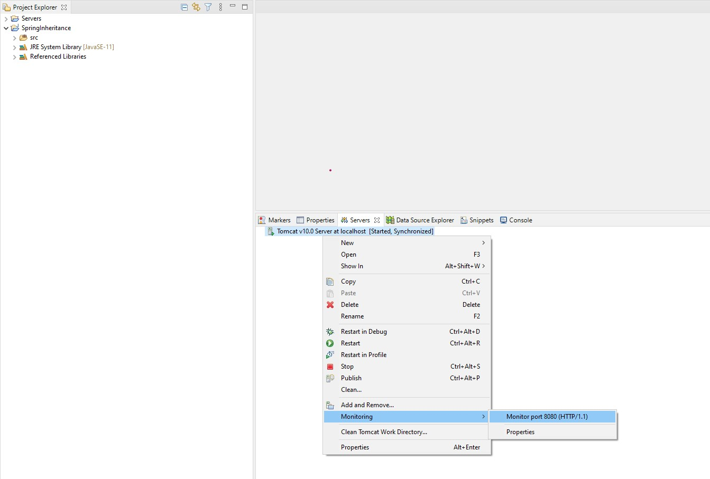
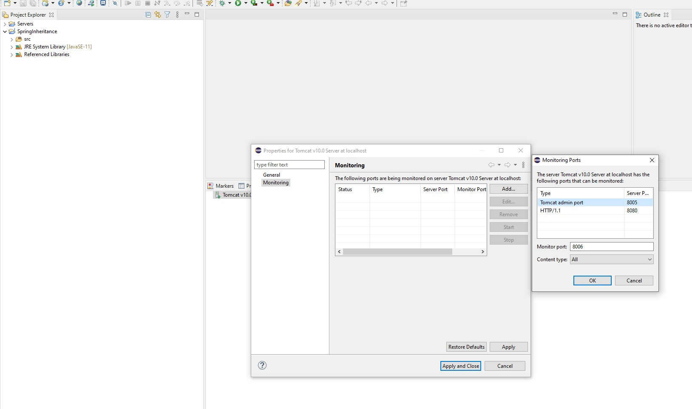
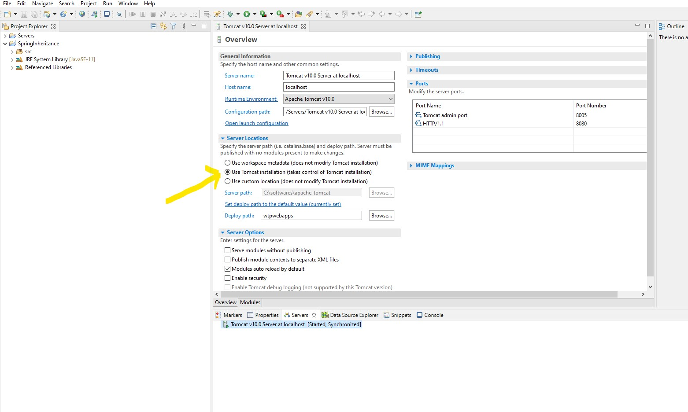
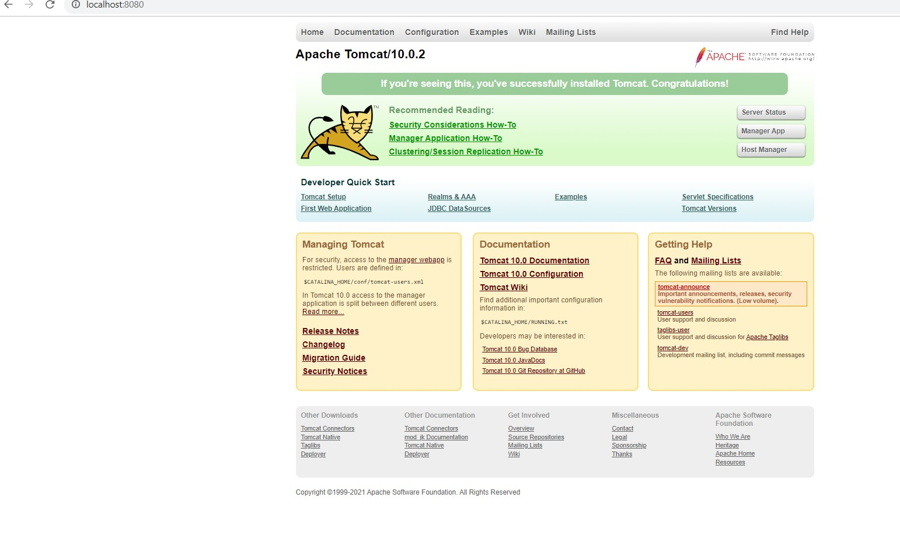

- Tomcat Download:

```text
download   https://downloads.apache.org/tomcat/tomcat-10/v10.0.2/bin/apache-tomcat-10.0.2-windows-x64.zip
copy to path C:\softwares\apache-tomcat-10.0.2 and rename to C:\softwares\apache-tomcat
```  

- install Java EE software



- After installation, you can change to  "Java EE" in "Windows->Perspective->Open Perspective->Other Perspective.

- Configure Tomcat Server




- Start Tomcat Server

 

Server Start Logs: 
```text
Mar 07, 2021 10:08:27 AM org.apache.catalina.core.AprLifecycleListener initializeSSL
INFO: OpenSSL successfully initialized [OpenSSL 1.1.1i  8 Dec 2020]
Mar 07, 2021 10:08:28 AM org.apache.coyote.AbstractProtocol init
INFO: Initializing ProtocolHandler ["http-nio-8080"]
Mar 07, 2021 10:08:28 AM org.apache.catalina.startup.Catalina load
INFO: Server initialization in [570] milliseconds
Mar 07, 2021 10:08:28 AM org.apache.catalina.core.StandardService startInternal
INFO: Starting service [Catalina]
Mar 07, 2021 10:08:28 AM org.apache.catalina.core.StandardEngine startInternal
INFO: Starting Servlet engine: [Apache Tomcat/10.0.2]
Mar 07, 2021 10:08:28 AM org.apache.catalina.util.SessionIdGeneratorBase createSecureRandom
WARNING: Creation of SecureRandom instance for session ID generation using [SHA1PRNG] took [101] milliseconds.
Mar 07, 2021 10:08:28 AM org.apache.coyote.AbstractProtocol start
INFO: Starting ProtocolHandler ["http-nio-8080"]
Mar 07, 2021 10:08:28 AM org.apache.catalina.startup.Catalina start
INFO: Server startup in [453] milliseconds

```

Output:
```text
http://localhost:8080 found HTTP Status 404 – Not Found error.
```
- Troubleshooting if 404 Not Found

- Right Click on Tomcat Server and Select Monitoring => Monitoring Port , check port is 8080 configured





- Double click and change Server Location as specified below and save Configuration: 



- Right Click Server and Start Again, you would see following page http://localhost:8080: 



