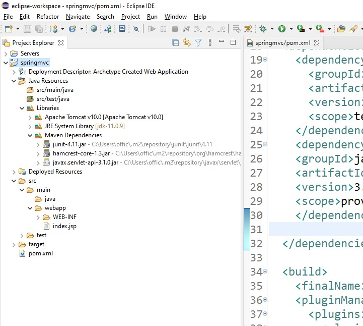
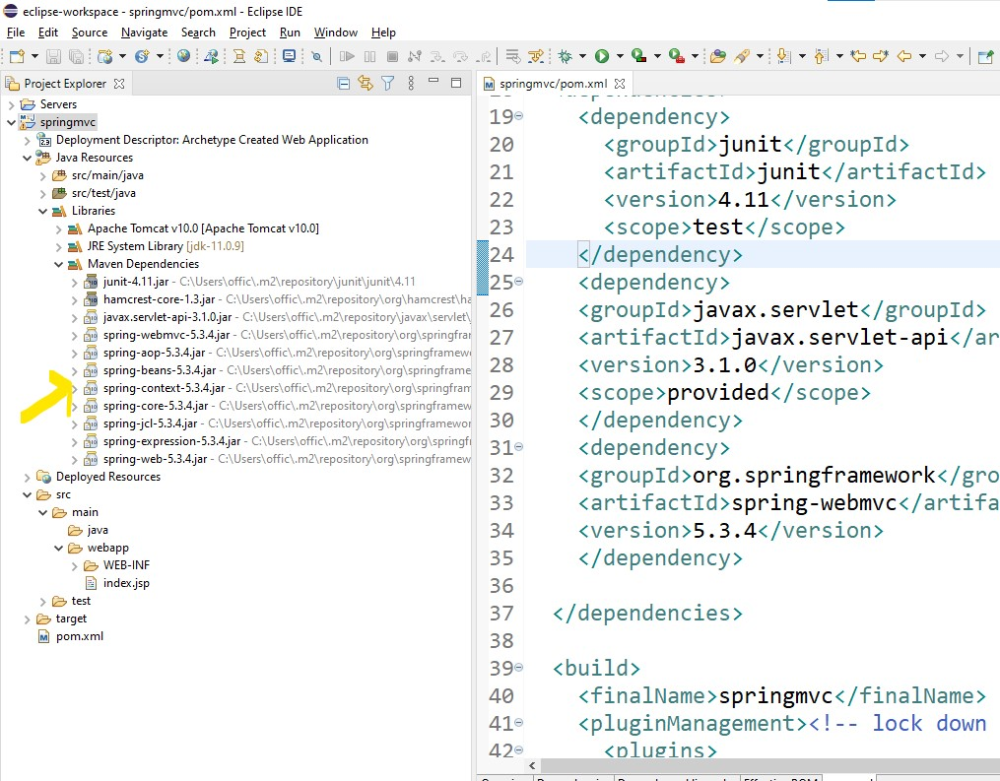
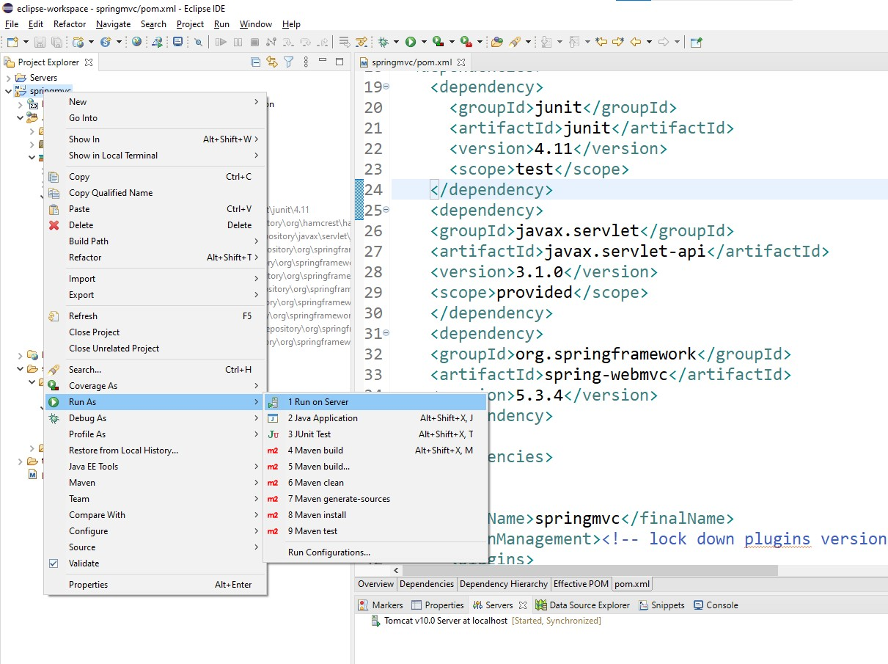
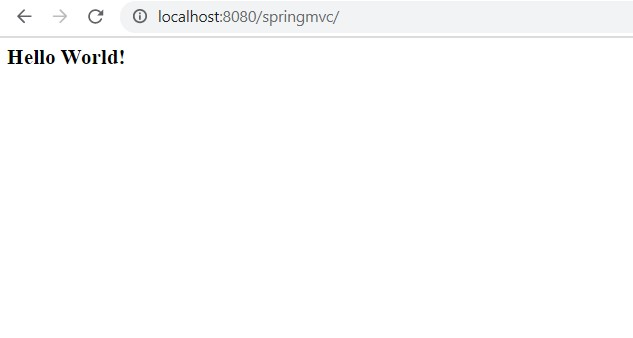

- Before: 




- we dont need to add libraries  manually rather we can just add following dependency in maven pom: 

```text
    <dependency>
    <groupId>org.springframework</groupId>
    <artifactId>spring-webmvc</artifactId>
    <version>5.3.4</version>
    </dependency>
```

- Right Click => Mavcen Prject => Update Project if its not loading on its own: 



- run project on server




