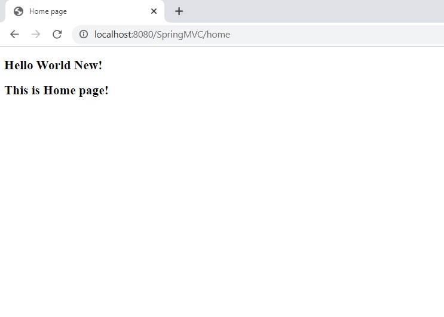

Repository:  https://github.com/njain51/springmvc
#### Steps: 

##### Configure dispatcher servlet in web.xml 

/springmvc/src/main/webapp/WEB-INF/web.xml
```text
<!--  Configure Dispatcher Servlet -->
   <servlet>
        <servlet-name>spring</servlet-name>
        <servlet-class>org.springframework.web.servlet.DispatcherServlet</servlet-class>
   </servlet>
   
   <servlet-mapping>
        <servlet-name>spring</servlet-name>
        <url-pattern>/</url-pattern>
   </servlet-mapping>
    
</web-app> 
```

#####  Create Spring Configuration file 

- to declare beans 

- create empty xml file with this name:  /springmvc/src/main/webapp/WEB-INF/spring-servlet.xml

```xml
<?xml version="1.0" encoding="UTF-8"?>

<beans xmlns = "http://www.springframework.org/schema/beans"
       xmlns:context = "http://www.springframework.org/schema/context"
       xmlns:xsi = "http://www.w3.org/2001/XMLSchema-instance"
       xsi:schemaLocation = "http://www.springframework.org/schema/beans     
   http://www.springframework.org/schema/beans/spring-beans-3.0.xsd
   http://www.springframework.org/schema/context 
   http://www.springframework.org/schema/context/spring-context-3.0.xsd">
    
</beans>
```

##### Configure View Resolver

- path: /springmvc/src/main/webapp/WEB-INF/spring-servlet.xml
- Added bean : org.springframework.web.servlet.view.InternalResourceViewResolver and provided two properties i.e., prefix and suffix

```xml
<?xml version="1.0" encoding="UTF-8"?>

<beans xmlns = "http://www.springframework.org/schema/beans"
       xmlns:context = "http://www.springframework.org/schema/context"
       xmlns:xsi = "http://www.w3.org/2001/XMLSchema-instance"
       xsi:schemaLocation = "http://www.springframework.org/schema/beans     
   http://www.springframework.org/schema/beans/spring-beans-3.0.xsd
   http://www.springframework.org/schema/context 
   http://www.springframework.org/schema/context/spring-context-3.0.xsd">

    <bean class="org.springframework.web.servlet.view.InternalResourceViewResolver" name="viewResolver">
        <property name="prefix" value="/WEB-INF/views/"></property>
        <property name="suffix" value=".jsp"></property>

    </bean>

</beans>
```

##### Create Controller 

- Added /springmvc/src/main/java/springmvc/HomeController.java

```java
package springmvc;

import org.springframework.stereotype.Controller;
import org.springframework.web.bind.annotation.RequestMapping;

@Controller
public class HomeController {
	
	// it will return view name
	@RequestMapping("/home")
	public String home() {
		System.out.println("This is home URL");
		return "index";
	}

}

```

#####  Create a View to show page 

- Create view: /springmvc/src/main/webapp/WEB-INF/views/index.jsp

```text
<html>
<head>
<title>Home page</title>
</head>
<body>
<h2>Hello World New!</h2>
<h2>This is Home page!</h2>
</body>
</html>

```

- Added following in /springmvc/src/main/webapp/WEB-INF/spring-servlet.xml to tell Spring Container to use Annotations based congfigurations: 

```text
 <context:component-scan base-package="springmvc.controller"/>
```


- Right Click application and Run on Server



code checked in here: https://github.com/njain51/springmvc/tree/1.0
