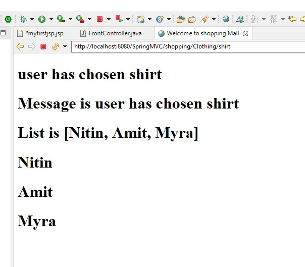

# Passing list from controler to view:

FrontController.java
```text
@RequestMapping("mylist")
	public String mylist(Model model){
		
		List<String> list1 = new ArrayList<String>();
		list1.add("Nitin");
		list1.add("Amit");
		list1.add("Myra");
		
	    model.addAttribute("l",list1);
	    return "myfirstjsp";
		
		
	}
```
jsp code:
```text
<!-- Getting List here -->

	<%
	List<String> obj1 = (List<String>) request.getAttribute("list");
	%>
    
    <!-- Displaying List here -->
	<h1>
		List is
		<%=obj1%></h1>
    <!-- Displaying List here using for loop -->
    
	<%
	for (String s : obj1) {
	%>

	<h1><%=s%></h1>

	<%
	}
	%>
```

output:

