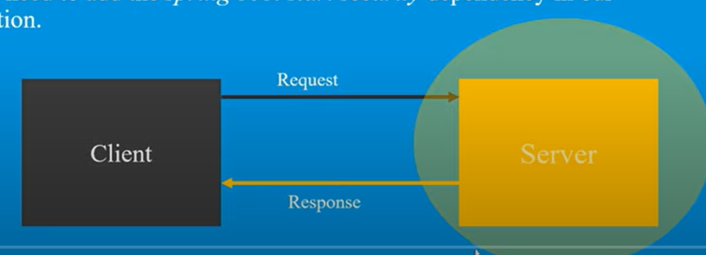

# Spring Security

- it helps to secure apps created via Spring/SpringBoot so that unauthenticated users cannot access our application. 

 
  

- SpringBoot secure our web application by default and further we can customize as per need

- we just need to add spring boot starter security dependency in our application 

```text
<!-- https://mvnrepository.com/artifact/org.springframework.boot/spring-boot-starter-security -->
<dependency>
    <groupId>org.springframework.boot</groupId>
    <artifactId>spring-boot-starter-security</artifactId>
    <version>2.5.5</version>
</dependency>

```

##### Authentication: 

- identity of users are checked for providing access to System 

##### Authorization:

- Giving the user permission to acess specific resource or function. 

##### Filter:

- it's an object which is invoked at preprocessing and postprocessing of a request.
- Spring Security takes filter help to validate request at preprocessing and postprocessing stage. 


